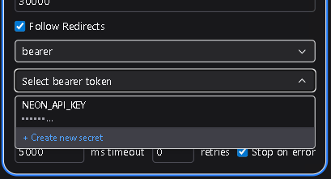
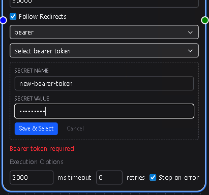
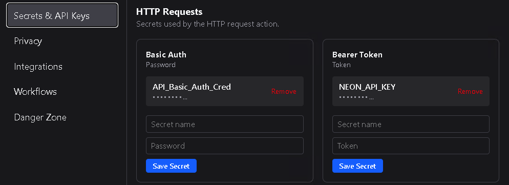

# Workflow Authentication

Many workflows require authentication to connect with external services—email providers, APIs, CRMs, and so on.  
DSentr handles these credentials through **Secrets & API Keys**, a centralized system that keeps sensitive information secure and out of your workflow logic.

---

## Where Secrets Live

All credentials—API keys, tokens, usernames, passwords—are stored in **Settings → Secrets & API Keys**.  
Each secret is encrypted and scoped to your workspace, meaning no one outside of that workspace can use it.

Once a secret is added to an action type, it becomes available to any node of that action type that supports authentication.  
This lets you reuse the same credentials across multiple workflows without re-entering or exposing them.

---

## Using Credentials in Nodes

When configuring a node that requires authentication or an API Secret (for example, Slack, SendGrid, or an HTTP Requests basic auth or bearer token), you’ll see a **Credentials** dropdown.

- If credentials already exist for that service, simply select one from the list.  
- If no credentials are available, click **Create New** right from the node configuration.  
  You’ll be prompted to add the required key or token, and DSentr will automatically save it to **Secrets & API Keys** in your settings.

This inline creation flow saves time and keeps your configuration consistent—no need to leave the canvas to manage secrets.

---

## Why It Matters

Centralized secret management ensures:
- **Security** – Credentials never appear in plaintext in workflows or logs.  
- **Reusability** – The same key can be shared by multiple nodes or workflows.  
- **Simplicity** – You don’t need to remember which node uses which credentials; DSentr handles that mapping automatically.

---

In short, Secrets & API Keys act as the bridge between your workflows and the external services they interact with.  
They make integrations safer, cleaner, and far easier to maintain—no hardcoded tokens, no duplicated API keys, and no accidental leaks in shared workflows.
