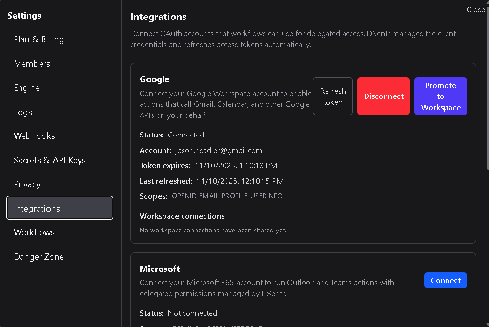
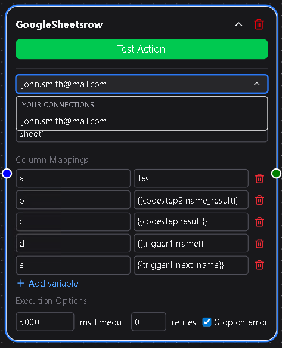
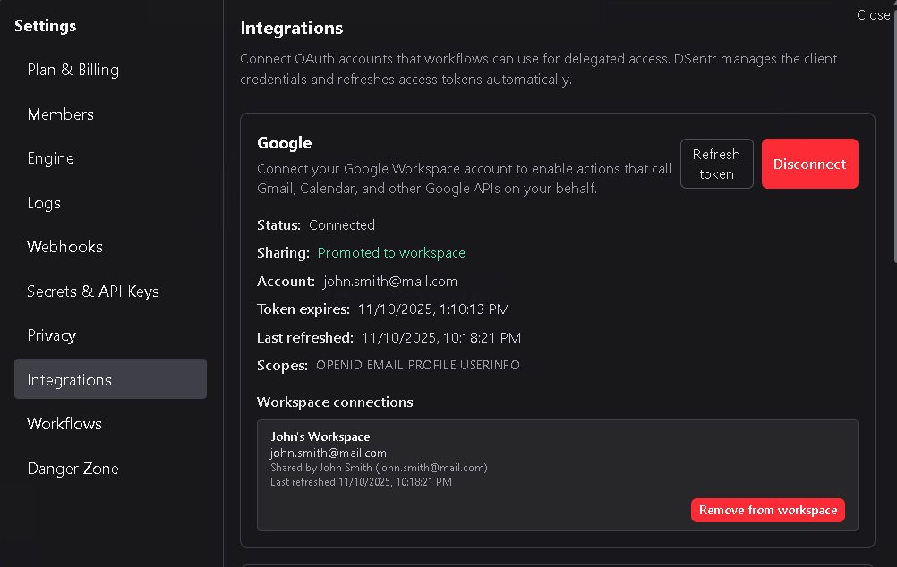
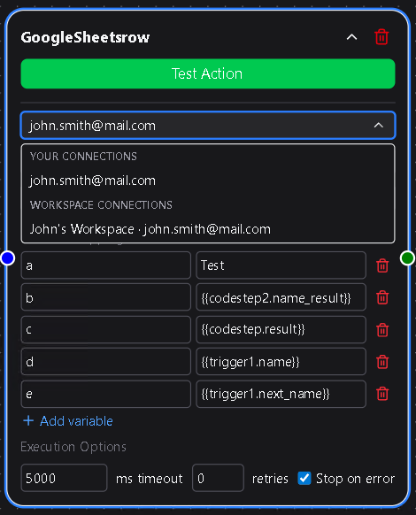

# OAuth Integrations

OAuth Integrations allow DSentr to connect securely to third-party platforms without requiring you to manage API keys manually.  
This feature is available **only on Workspace plans** and provides a simple, secure way to link your workspace with major services.

Currently, DSentr supports OAuth connections for **Google**, **Microsoft**, and **Slack**.

---

## Setting Up OAuth Connections

To connect a service, go to **Settings → Integrations** and click **Connect** next to the desired provider.  
You’ll be redirected to the provider’s authorization page where you can approve DSentr’s access to your account.  
Once complete, your connection will appear under **Active Integrations** and will be available for use in compatible nodes.

---

## Using OAuth in Workflows

When configuring a node that supports OAuth (for example, sending a Slack message or updating a Google Sheet), you’ll see an **OAuth Connection** dropdown.  
From there, you can simply select your saved connection—no tokens or secrets required.

If multiple users in the workspace have active OAuth connections for the same provider, any of those connections can be selected in supported nodes.

---

## Promoting Personal Connections to Workspace-Level Access

Users can choose to **promote** their personal OAuth connection to a **workspace connection**.  
This makes the connection available to all members of the workspace, allowing shared workflows to use the same credentials without each member needing to connect separately.

This is especially useful for team automations—such as shared Slack posting or Sheets synchronization—where a single account should represent the workspace’s actions.

---

## Connection Ownership and Revocation

OAuth connections are always owned by the user who created them.  
If that user **removes** or **disconnects** their connection:

- The connection immediately disappears from the workspace’s available integrations.
- Any workflows relying on that connection will stop functioning until a valid replacement is selected.

Similarly, if a user **leaves or is removed from a workspace**, their OAuth connections are automatically revoked from that workspace.  
Workflows that depended on them must be updated to use another available OAuth connection.

---

## Best Practices

- Use **workspace-level connections** for shared automations to avoid dependency on a single user’s credentials.  
- Periodically review active integrations under **Settings → Integrations** to ensure connections are still valid.  
- Replace or refresh expired tokens promptly to prevent workflow interruptions.

---

OAuth Integrations streamline authentication and maintain security while keeping workflows flexible.  
They let teams collaborate on shared automations without juggling personal API keys, ensuring that every integration stays connected, authorized, and under control.
