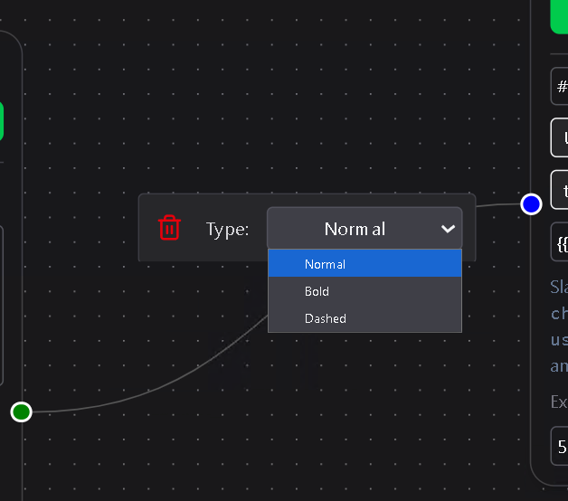

# Edges

Edges are the connectors between nodes on the workflow canvas.  
They define the order in which your workflow executes and determine how data flows from one node to the next.

An edge begins at the output of one node and ends at the input of another.  
When a trigger or action completes, its output travels through these edges to whatever follows, ensuring each step runs in sequence or conditionally, depending on your design.

---

## Interaction

Clicking on an edge opens a small inline menu that lets you:

- **Change appearance** – Toggle between **Normal**, **Bold**, or **Dashed** line styles.  
  (These are purely visual; they do not affect workflow behavior.)
- **Delete** – Removes the edge from the canvas, breaking the connection between the two nodes.

---

Edges make the workflow visual and logical at the same time.  
They show exactly how information and actions connect—clear, flexible, and easy to rewire whenever your automation changes.
