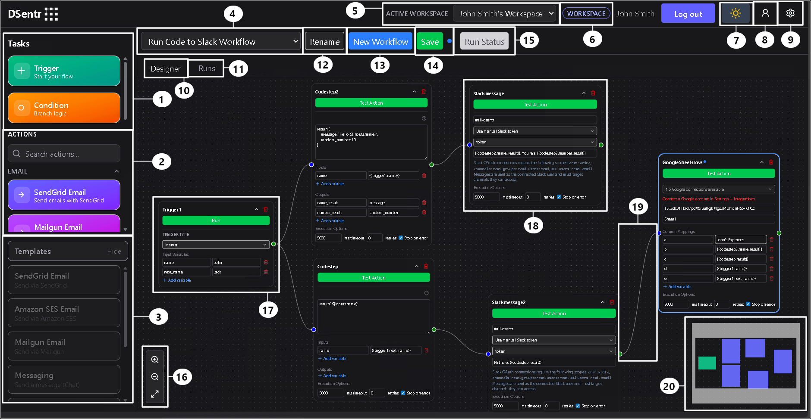

# The Dashboard

The DSentr dashboard is where you design and manage your workflows.  
This is the heart of the platform—where triggers, actions, and logic come together to automate tasks across your connected services.

At the top of this page, you'll see an annotated image highlighting the main areas of the dashboard. Each numbered callout corresponds to a key feature or section explained below.

---

## Overview

The dashboard canvas is your workspace.  
You can drag nodes onto it, connect them with edges, and visually build out entire workflows without writing a line of backend code. Every node represents an event, condition, or action that moves your automation forward.

---

## Interface Legend

### 1. Trigger and Condition Nodes
Trigger nodes start your workflow; they listen for an event or await manual execution.  
Condition nodes introduce branching logic, allowing workflows to make decisions based on incoming data.

### 2. Action Nodes
These are DSentr’s building blocks for doing things—sending messages, updating sheets, calling APIs, and more.  
Each node represents a specific integration or operation, and you can chain multiple actions together to create complex flows.

### 3. Templates
Templates give you a quick start.  
From an empty canvas, you can load prebuilt workflows like “Send Email” or “Post to Slack,” then adjust them to fit your needs.

### 4. Workflow Picker
This dropdown lists your saved workflows. Select one to switch contexts instantly and continue where you left off.

### 5. Active Workspace
Visible only when you’re a member of multiple workspaces.  
It lets you toggle between your personal workspace and any shared ones you’ve joined through invitations.

### 6. Plan Badge
Displays either **Workspace** or **Solo**, depending on your current plan.  
It’s a simple visual cue for which plan’s limits and features apply to the workspace you’re in.

### 7. Theme Switcher
Switch between light and dark modes. Your preference is saved automatically.

### 8. Profile Menu
Opens personal account options such as changing your password.

### 9. Settings Menu
Provides access to workspace-level settings: billing, webhooks, secrets, and integrations.

### 10. Designer Tab
The main stage.  
Here you’ll build and connect nodes, configure triggers and actions, and visualize your workflow as it runs.

### 11. Runs Tab
Shows current workflow runs, including queued and running executions.

### 12. Rename
Lets you rename the current workflow.  
Useful when cloning or reworking an existing one.

### 13. New Workflow
Creates a fresh, blank workflow canvas.  
Your current work is preserved as long as it’s saved before switching.

### 14. Save
Enabled when you make unsaved changes to your workflow.  
Click to persist those updates to your workspace.

### 15. Run Status
Indicates when a workflow is running.  
Clicking it switches to the **Runs** tab for live execution tracking.

### 16. Canvas Controls
Zoom in, zoom out, or reset the view.  
You can also use your mouse wheel to zoom or click and drag to pan across the canvas.

### 17. Trigger Node
Every workflow starts here.  
Triggers define when and how your automation begins—via webhook, schedule, or manual run.

### 18. Action Node
Action nodes perform the steps of your automation.  
They can transform data, send messages, make API requests, or update other systems.

### 19. Edge
Edges are the lines connecting your nodes.  
They define the path your workflow follows and control the order of execution.

### 20. Minimap
A small map in the corner showing your overall workflow layout.  
It helps you navigate large or complex workflows quickly.

---

Together, these components form the core interface of DSentr.  
Once you’re familiar with where everything lives, you can move seamlessly from building your first workflow to managing entire automation systems across multiple workspaces.
