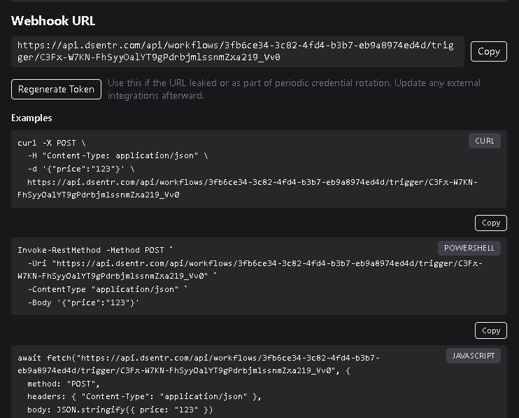

# Your First Workflow

Workflows in **DSentr** connect triggers and actions to automate tasks.  
This guide shows you how to build a simple automation that posts a Slack message when a webhook receives data.

---

## 1. Create a new workflow

1. In your workspace dashboard, click **New Workflow** to open a new workflow canvas.  
2. Optionally give it a name, for example **Slack Notifier**, by clicking **Rename** and entering a new name and **Save**.

You’ll start with an empty canvas.

---

## 2. Add a trigger

A **trigger** starts the workflow whenever an event occurs.

1. From the sidebar, drag a new **Trigger** onto the canvas.  
2. Choose **Webhook**.
3. Add an input variable by clicking **Add variable**. This allows you to add data variables that can be consumed by your workflow and referenced in proceeding nodes.
  - Create a variable called `price`
  - For the value, we will expect that the webhook call will consume a payload with a property called `price`. For our trigger to be able to reference `price` from the payload we will use **Templating** with the trigger name in conjunction with dot notation. For the value, enter `{{Trigger.price}}`. If you change the name of the trigger to something else (like `TestTrigger`), we would need to update our variables value to reference this: `{{TestTrigger.price}}`.

  **Note: The Input Variables on a Trigger are different from Input Variables on other nodes as the Trigger acts as an input. More on this in the ***Triggers*** section**

You now have a workflow that can be reached via a webhook:
```bash
curl -X POST -H "Content-Type: application/json" \
-d '{"message":"Hello from DSentr"}' \
https://api.DSentr.com/api/workflows/<workflow-id>/trigger/<token>
```
1. Click the **Settings** icon (gear) in the top-right corner.  
2. Open the **Webhook** section.  
3. Copy the provided URL, which includes both the workflow ID and the unique **token** that authenticates incoming requests.



To find your full webhook URL:

---

## 3. Understanding the webhook token

The **workflow token** is a unique secret that authorizes webhook calls to your workflow.  
Think of it as an access key—anyone with this token can trigger your workflow.

If you suspect it has been exposed or you simply want to rotate it, click **Regenerate Token** in the Webhook settings panel.

When you regenerate a token:
- DSentr immediately invalidates the old one.  
- A new token is generated and displayed in the webhook URL.  
- Any external systems or scripts using the old webhook URL will stop working until you update them with the new token.

Always replace the old token in every service, script, or integration that references it.

---

So while we now have a working workflow, it doesn't really do anything except consume a payload and then exit. Let's add some more to our workflow with **Actions**

## 4. Add an action

1. Drag a new **Slack Action** node onto the canvas. 
2. Paste your Slack webhook URL or select a connected Slack account (Connecting your Slack account can be done in **Settings->Integrations**).  
3. Set the message content to:

`In from webhook: {{trigger.message}}`

The `{{trigger.message}}` syntax inserts the data sent from your webhook payload.

---

## 5. Connect the nodes

Drag a connector line (called **Edges**) from the **Webhook Trigger** output to the **Slack Action** input.  
Your workflow now passes incoming data from our trigger's webhook payload, into the trigger, into your Slack node, and then  directly into Slack.

---

## 6. Test the workflow

1. Click **Save**.   
2. Send a new POST request to your webhook URL using the same `curl` command.

If your Slack channel displays `In from webhook: Hello from DSentr`, the workflow is working.

---

Your first workflow is now live and ready to automate incoming data!
