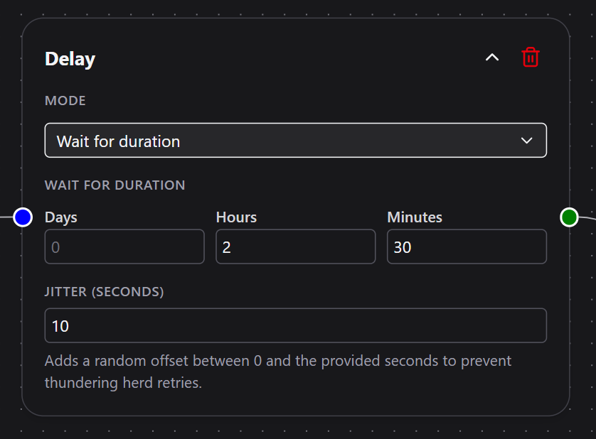
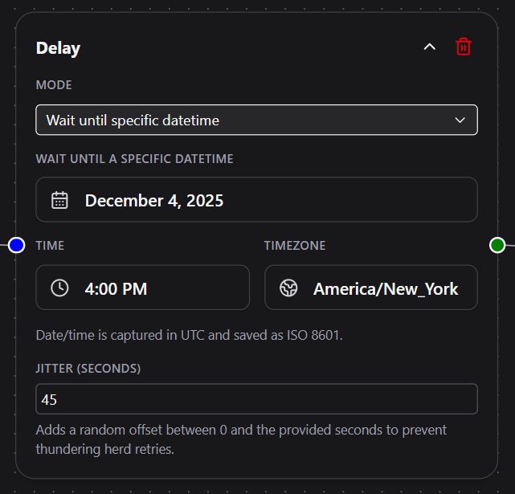

# Delay

The **Delay** node pauses a workflow for a defined period of time or until a specific future date and time.  
Use it to space out actions, schedule follow-ups, or create controlled waits before continuing execution.

---

## Overview

This node lets you control exactly *when* the next step in a workflow should run.  
You can either wait for a relative duration (for example 1 hour, 10 minutes) or wait until an exact datetime chosen by the user.  
It is ideal for scheduled follow-ups, retry spacing, and long-running sequences that should not block the engine.

 

---

## Configuration

### Mode  
Determines which type of delay will be applied.

Choose from:

- **Wait for Duration** — Pause the workflow for a specific number of days, hours, or minutes.  
- **Wait until specific datetime** — Pause until a chosen date and time.

**Required**

---

## Wait for Duration

Visible only when **Wait for Duration** is selected.

### Days  
Number of days to wait.  
**Must be a non-negative number.**

### Hours  
Number of hours to wait.  
**Must be a non-negative number.**

### Minutes  
Number of minutes to wait.  
**Must be a non-negative number.**

At least one of these must be greater than zero.  
All duration fields default to `0`.

---

## Wait until specific datetime

Visible only when **Wait until specific datetime** is selected.

### Date Picker  
Choose a calendar date.  
Selecting a date is required.

### Time (24-hour)  
Choose a specific time of day (hours and minutes).  
Required when using datetime mode.

### Time Zone  
Select the time zone in which the datetime should be interpreted.  
This ensures the delay resumes at the correct moment regardless of user location or server region.

A complete datetime (date, time, and time zone) is required.

---

## Jitter (Seconds)

Adds a random offset between `0` and the specified number of seconds.  
This prevents many delayed runs from resuming at the exact same moment, which can overload external services or your own workflow engine.

Example:  
If jitter is set to `60`, the workflow will resume at any point within the next 60 seconds after the scheduled time.

**Optional**

---

## Behavior

- When the workflow reaches this node, DSentr calculates the target resume time based on the selected mode.  
- The workflow state is saved and execution pauses.  
- The engine schedules a continuation and releases all resources.  
- When the scheduled time arrives, the workflow resumes at the next node.  
- If jitter is enabled, the system randomly delays the resume time within the configured window.
- **If the workflow is edited during the delay, it will resume using the original saved state, not the updated design**

---

## Example Use Cases

- Send a follow-up email 24 hours after a user signs up.  
- Wait 10 minutes before retrying an external API call.  
- Space out Slack or SMS notifications to avoid overwhelming recipients.  
- Hold a workflow until the start of a business day in a specific time zone.  
- Schedule a phased onboarding sequence: welcome now, next steps tomorrow morning.

---

## Example Configuration

| Field | Example |
|-------|---------|
| Mode | Wait for Duration |
| Days | `1` |
| Hours | `0` |
| Minutes | `30` |
| Jitter (Seconds) | `45` |

---

## Tips

- Use **Wait until specific datetime** for scheduled events tied to a calendar date.  
- Use **Wait for Duration** for flexible delays like retries, cool-offs, or spacing notifications.  
- Add jitter when many workflows might resume simultaneously, such as after an outage or during batch processing.  
- Combine with Conditions or HTTP Request nodes to build robust retry logic.

---

The **Delay** node gives workflows precise timing control without holding system resources.  
It is the foundation for scheduled, phased, and resilient automation sequences in DSentr.
