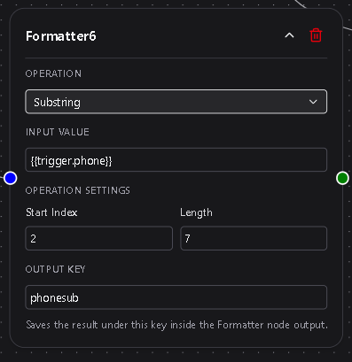
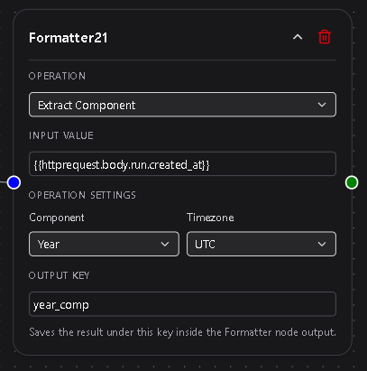

# Formatter

The **Formatter** node reshapes, converts, or cleans workflow data before passing it to downstream steps.  
Use it to extract values from complex objects, normalize text, manipulate numbers, convert dates, and build structured JSON.

Formatter evaluates an input value, applies a chosen operation, and stores the result under an output key for downstream nodes.

---

## Overview

Formatter performs synchronous, CPU-only transformations.  
Every operation is typed and predictable. The output is available to templates, conditions, and action nodes.

Typical uses:

• Extract nested fields from JSON responses  
• Clean or normalize strings  
• Perform arithmetic on templated values  
• Convert dates and timestamps  
• Build JSON fragments for outbound requests  



---

## Configuration

Formatter exposes four configuration areas.

### Operation  
A dropdown selecting the transformation to apply.  
Grouped into Strings, Numbers, JSON, Dates, Booleans, and Type Conversion.

**Required**

---

### Input Value  
The value to transform.  
Accepts literal text or Dsentr templates such as `{{trigger.email}}`.

**Required**

---

### Operation-Specific Fields  
Displayed only when relevant to the chosen operation.  
Defines operands, delimiters, date formats, JSON paths, etc.

---

### Output Key  
A variable name that stores the result.  
Must be a valid identifier: letters, numbers, underscores; no spaces.

**Required**

---

# Operation Groups and Details

Below is a complete reference of all operations and their fields.

---

# String Operations

## Trim  
Removes leading and trailing whitespace.  
Fields: none

---

## Lowercase  
Converts text to lowercase.  
Fields: none

---

## Uppercase  
Converts text to uppercase.  
Fields: none

---

## Replace  
Replaces all occurrences of a substring.

Fields:  
• **Search For**  
• **Replace With**

Example:  
`ACME-123` → `ACME_123`

---

## Split  
Splits a string and returns a single segment.

Fields:  
• **Delimiter**  
• **Index** (zero-based)

Example:  
`a,b,c` with index 1 → `b`

---

## Substring  
Extracts characters from input.

Fields:  
• **Start Index**  
• **Length**

---

# Number Operations

Input is parsed as a number.

## Add / Subtract / Multiply / Divide  
Applies arithmetic.

Field:  
• **Value** (number)

Divide protects against zero.

---

## Round  
Rounds to a fixed precision.

Field:  
• **Decimal Places** (0–15)

---

## Convert to Number  
Parses the input into numeric form.

Fields: none

---

# JSON Operations

Input must be valid JSON.

## Pick Field  
Extracts a nested value using dotted paths.

Field:  
• **JSON Path**

Example path: `items.0.id`

---

## Flatten  
Converts nested JSON structures into a flat object with dotted keys.

Example:  
```
{"a":{"b":1},"c":[10,20]}
```

Becomes:  
```
{"a.b":1,"c.0":10,"c.1":20}
```

Fields: none

---

## Merge  
Merges two objects.

Field:  
• **Second JSON Input**

Keys from the second object override existing values.

---

## Convert to Array  
Converts strings or arrays into a JSON array.

Fields:  
• **Delimiter**  
• **Trim Items** (toggle)

Examples:  
• `"a, b ,c"` → ```["a","b","c"]```  
• JSON arrays stay arrays

---

## Convert to Object  
Creates an object with the input value under a chosen key.

Field:  
• **Key Name**

Example: input `"hello"` → ```{"msg":"hello"}```

---

# Date Operations

Supports ISO8601, RFC2822, YYYY-MM-DD, MM/DD/YYYY, Unix seconds, Unix milliseconds.



## Parse  
Parses input using a selected format.

Field:  
• **Input Format**

---

## Format  
Converts a date into another format.

Field:  
• **Output Format**

Supported formats:  
• rfc3339  
• rfc2822  
• date_only  
• datetime  
• us_short  
• unix_seconds  
• unix_milliseconds  

---

## Add/Subtract Time  
Adjusts a date by offsets.

Fields:  
• **Days**  
• **Hours**  
• **Minutes**

At least one must be non-zero.

---

## Extract Component  
Extracts a single attribute.

Fields:  
• **Component** (year, month, day, hour, minute, second, weekday)  
• **Timezone** (IANA zone)

---

# Boolean Operations

## To Boolean  
Interprets various types as true/false.

Truthy examples: `"true"`, `"yes"`, `"1"`  
Falsey examples: `""`, `"0"`, `"false"`

---

## Is Empty  
Returns true for empty values:

• empty string  
• null  
• false  
• empty array  
• empty object  

---

# Type Conversion

## Convert to String  
Converts any value to text.

Examples:  
• Number → `"42"`  
• Boolean → `"true"`  
• JSON → serialized string  

---

# Behavior

• Executes synchronously with no network calls.  
• Output values retain their native type.  
• Downstream templates access them via `{{formatter.output_key}}`.  
• Formatter never overwrites trigger or action namespaces.  
• Outputs are snapshot-friendly for resumed delayed workflows.  
• JSON path resolution uses the same logic as HTTP Response mapping.

---

# Example Use Cases

• Extract `order.items.0.id` from an API response  
• Normalize names before storing or matching  
• Convert timestamps into readable forms  
• Merge partial payloads before sending to an external service  
• Break up long strings into structured arrays  

---

# Best Practices

• Use descriptive keys like `clean_email` or `parsed_timestamp`.  
• Keep transformations simple; chain Formatter nodes when needed.  
• Normalize data types early in a workflow.  
• Preview JSON fields to avoid path errors.  
• Use Flatten before Pick Field when dealing with extremely nested structures.
