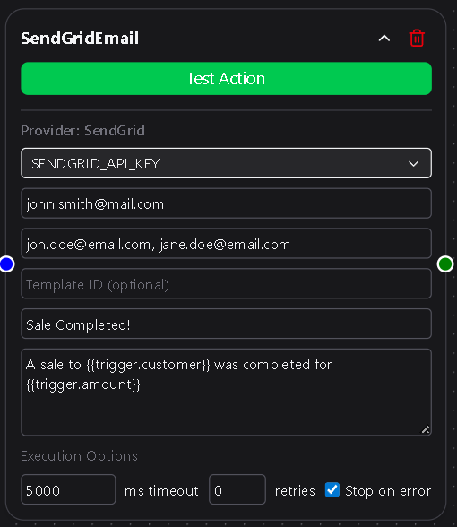
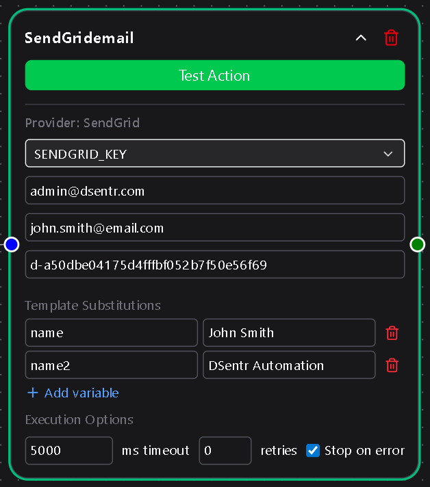

# SendGrid Email Node

The **SendGrid Email** action node allows your workflow to send emails through [SendGrid](https://sendgrid.com/), a trusted and widely used transactional email platform.  
With this node, you can send standard emails directly from DSentr or use **dynamic templates** from your SendGrid account for fully customized and branded messages.

This node connects securely using your SendGrid API key and supports both direct message sending and templated delivery with variable substitutions.

---

## Configuration

### API Key  
Select or create a **SendGrid API Key** from the dropdown.  
This key is securely stored in **Settings → Secrets & API Keys** and is required for the node to connect to SendGrid.  
If you don’t have an API key yet, you can create one in your [SendGrid dashboard](https://app.sendgrid.com/settings/api_keys) with “Mail Send” permissions.

**Required**

---

### From Email  
The sender’s email address shown in the email header.  
SendGrid requires verified senders before messages can be sent from a specific address or domain.  
You can verify your sender identity through SendGrid by following their guide on [Sender Verification](https://www.twilio.com/docs/sendgrid/ui/sending-email/sender-verification).

**Required**

---

### To Emails  
A comma-separated list of recipient email addresses.  
For example:  
`user1@example.com, user2@example.com, user3@example.com`

**Required**

---

### Template ID *(optional)*  
Enter a SendGrid **Template ID** to use a dynamic template from your account.  
When a Template ID is provided:
- The **Subject** and **Body** fields are hidden (content is managed by SendGrid).  
- A **Template Substitutions** section becomes available to define key-value pairs used within your template.  

For details on creating and managing templates, see SendGrid’s documentation on [sending dynamic templates](https://www.twilio.com/docs/sendgrid/ui/sending-email/how-to-send-an-email-with-dynamic-templates).

**Optional**

---

### Template Substitutions  
If a Template ID is set, you can define one or more **Template Substitutions**—key-value pairs that fill placeholders in your SendGrid dynamic template.

Each substitution represents a variable expected by the template.  
For example, if your SendGrid template contains variables like `{{name}}` or `{{order_number}}`, you would define:

| Key | Value |
| --- | --- |
| name | `{{trigger.customer_name}}` |
| order_number | `{{action.latest_order_id}}` |

These values are substituted when the email is sent.  
You can add as many key-value pairs as needed to match your template’s variables.  
If no Template ID is specified, this section is hidden.

---

### Subject  
The subject line of the email.  
Visible only when no Template ID is set.

**Required if Template ID is blank**

---

### Body  
The message content of the email.  
Accepts plain text or HTML.  
Like the subject, this field is only shown when no Template ID is provided.

**Required if Template ID is blank**

---

## Usage Notes

- Variable placeholders such as `{{trigger.email}}` or `{{node.output_value}}` can be used in both **Subject**, **Body**, and **Template Substitution Values**.  
- SendGrid requires verified senders and enforces rate limits; any API or validation errors are shown in **Run Logs** for debugging.  
- Combine this node with **Condition** or **Branch** nodes to send different templates based on workflow logic.  
- Use **Template Substitutions** to personalize content dynamically for each run without modifying the template itself.  

---

The SendGrid Email node provides a seamless bridge between DSentr and SendGrid, making it easy to automate messaging, notifications, and alerts without touching raw APIs or writing integration code.  
It’s flexible enough for transactional messages, onboarding emails, or custom notifications triggered directly by your workflows.
