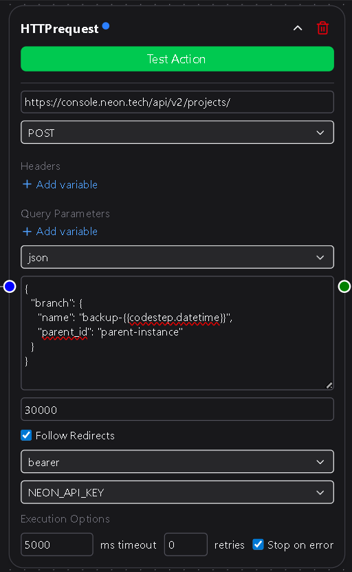

# Action Nodes

**Action Nodes** perform tasks inside a workflow — sending messages, inserting data, or calling external APIs.  
They represent the “work” that happens after a trigger fires and before the workflow completes.

Action nodes can stand alone, or they can use variables from previous nodes to customize their behavior.

---

## 1. What action nodes do

Each action node executes a specific function such as:
- Sending a Slack message  
- Adding a row to Google Sheets  
- Posting to a Microsoft Teams channel  
- Sending an email  
- Making an HTTP request  

As DSentr grows, new built-in action nodes will continue to be added to this library.  
<!-- You can also build **custom action nodes** to connect your own systems or APIs (covered later in the *Custom Nodes* section). -->

---

## 2. Inputs and outputs

Action nodes vary in how they handle data:

| Type | Behavior |
|------|-----------|
| **Input-driven** | Require one or more mapped fields (for example, message text or column data). |
| **Static** | Run with fixed configuration and no variable input. |
| **Output-producing** | Return values that become available as variables for later nodes. |

Not every action node accepts inputs or produces outputs.  
Some simply perform an operation and stop, while others return data that subsequent nodes can use.

---

## 3. Variable usage

Action nodes can reference any variable created by:
- The trigger node  
- Earlier action nodes  
- Condition nodes that passed flow control  

Variables are referenced using the same `{{nodename.variable}}` format described in the [Nodes Overview](../overview.md).  
All variables from upstream nodes remain available to any downstream node, ensuring smooth data flow across the workflow.

---

## 4. Execution behavior

Action nodes execute sequentially based on how they’re connected in the workflow canvas.  
Each one runs after the nodes that feed into it have completed successfully.

If an action fails, DSentr stops execution for that branch unless error handling or fallback logic is defined.  
You can review the result of each action node in the **Run Log**, which includes input values, outputs, and any error messages.

### Execution options

Every action node includes **execution options** at the bottom of its configuration panel:

| Option | Description |
|---------|--------------|
| **Timeout (ms)** | Maximum time the node may run before it’s aborted. Use this to prevent long-running or hanging requests. |
| **Retries** | Number of times DSentr will automatically retry the action if it fails. Useful for transient API or network errors. |
| **Stop Workflow on Error** | When checked, halts the workflow immediately if this node fails. When unchecked, execution continues along remaining branches. |

These options let you control reliability and failure behavior per node without global settings.

---

## 5. Types of action nodes

Action nodes are organized by category, such as:
- **Communication** (Slack, Email, Microsoft Teams)  
- **Data & Storage** (Google Sheets, Databases, File Services)  
- **Utility** (Delays, HTTP Requests, Custom Functions)  

This list continues to expand as more integrations are added to DSentr.  
Each individual action node has its own page that explains setup, available fields, and output variables.

---

## 6. Best practices

- Use clear node names to make logs easier to interpret.  
- Map only the variables you need; avoid passing large payloads unnecessarily.  
- Configure timeouts and retries conservatively for APIs with rate limits.  
- Test each node individually using sample data before enabling the full workflow.  
- Combine multiple actions to build meaningful, multi-step automations.
<!-- - Reuse common configurations with node duplication.   -->

---

Action nodes are the backbone of every workflow.  
They transform input into results — connecting triggers, applying logic, and executing the actions that bring your automation to life.
