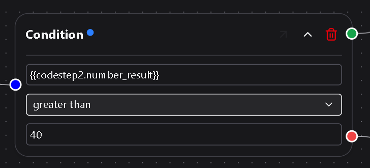

# Condition Node

The **Condition Node** controls workflow logic.  
It evaluates an expression using the current variables in scope and decides which branch of the workflow continues.  
This lets you add simple decision-making into otherwise linear workflows.

---

## 1. How it works

When a condition node runs, DSentr evaluates the expression you define in its **Condition** field.  
If the expression resolves to **true**, execution follows the **Yes** path.  
If it resolves to **false**, it follows the **No** path.  

Both branches continue using the same variable context that existed before the condition was evaluated — no new variables are created, and none are removed or modified.

---

## 2. Creating a condition

A condition expression can reference any variable available at that point in the workflow.  
Use the same templating syntax you use elsewhere in DSentr:

`{{trigger.amount}}`

You can compare numbers, text, or booleans, and use logical conditions:
- `equal`
- `not equal`
- `greater than`
- `less than`
- `contains`

If a comparison between the field and the comparison value yields true, the the `green` node output path is followed. Otherwise the comparison is false and the `red` output path is followed.

---

## 3. Inputs and outputs

Condition nodes:
- Do **not** accept standard inputs.  
- Do **not** produce outputs.  
- Pass the existing variables forward unchanged along either the **Yes** or **No** branch.  

You can place additional action nodes on either branch to define what should happen for each outcome.

---

## 4. Editing and testing

- **Editing:** Click the node on the canvas or use the **flyout menu** icon on hover to open it in the side panel.  
  Both editing modes stay in sync.  
- **Testing:** Run the workflow manually and inspect the **Run Log** to see which branch executed and which variables were evaluated.

---

## 5. Example use case

A common workflow:
1. **Trigger:** Webhook receives an order payload.  
2. **Condition:** `{{trigger.amount > 100}}`  
3. **Yes branch:** Sends a Slack notification for high-value orders.  
4. **No branch:** Inserts the order into Google Sheets only.

This setup filters logic within the same workflow without requiring separate automations.

---

## 6. Best practices

- Keep expressions simple and readable; use nested logic only when necessary.  
- Name condition nodes descriptively (for example, “Check Order Value” instead of “Condition1”).  
- Use multiple condition nodes for layered logic instead of chaining complex expressions.  
- Review run logs to confirm that branch behavior matches expectations.  

---

The **Condition Node** adds flexibility and control to workflows — letting you decide what happens next based on real-time data rather than fixed rules.
