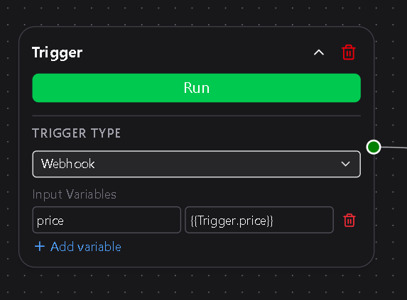
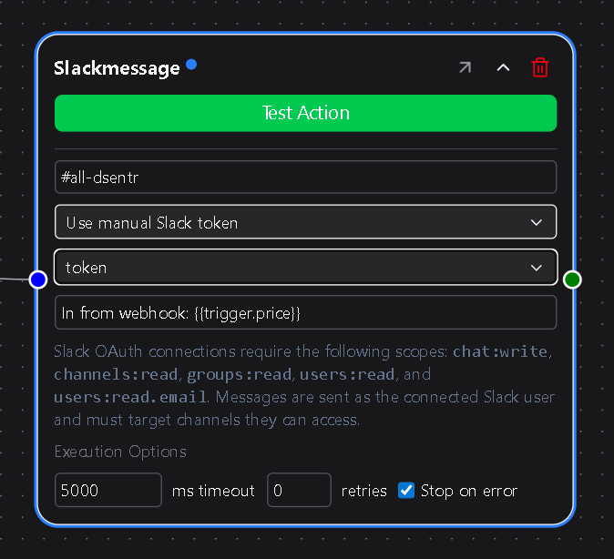
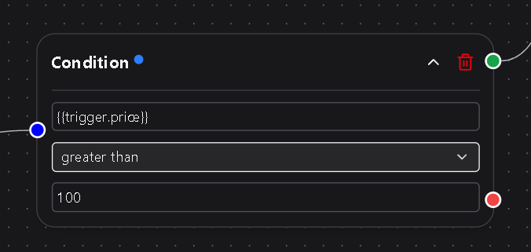
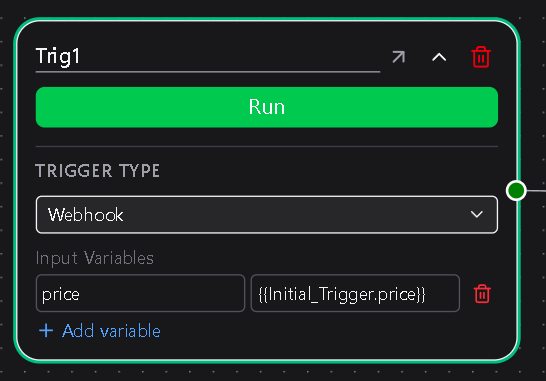
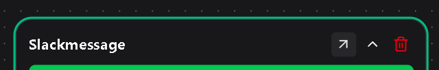
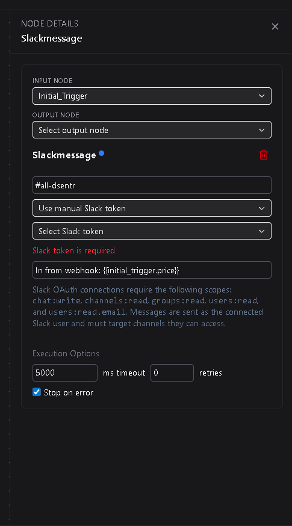
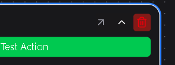

# Nodes Overview

Workflows in **DSentr** are composed of three main node types — **Trigger**, **Action**, and **Condition**.  
Each type serves a distinct purpose in defining how data flows and when each step executes.

---

## 1. Trigger nodes

A **Trigger Node** starts a workflow.  
It defines when and how the workflow begins and provides the first set of variables that other nodes can use.



### Trigger types

| Type | Description |
|------|--------------|
| **Manual** | Executes when you click **Run** in the editor or dashboard. Useful for testing or one-off executions. |
| **Webhook** | Starts automatically when an HTTP POST request is received at the workflow’s unique webhook URL. Common for app integrations and API-driven automations. |
| **Schedule** | Runs on a time interval. Available only on **Workspace** plans. |

Triggers do **not** accept inputs from other nodes.  
They emit initial variables (for example, webhook payload data or timestamps from a scheduled run) that downstream nodes can reference using expressions like `{{trigger.message}}` or `{{trigger.timestamp}}`.  

In short: **Triggers create the starting variable set for the entire workflow.**

See **[Triggers](./triggers/trigger-nodes.md)** for detailed configuration options.

---

## 2. Action nodes

An **Action Node** performs a task — sending data, calling an API, or updating a system.  
Actions can reference variables introduced by previous nodes, including triggers and other actions.



Action nodes vary in how they handle data:
- Some accept **inputs** and map them to fields (for example, message text or spreadsheet columns).  
- Others run independently with only static configuration.  
- Not every action produces an **output**, but any explicitly defined outputs (like a response body or status) become available as variables for later nodes.

Variables from triggers and earlier actions automatically remain in scope for downstream nodes.

Examples:
- **Slack Message** — Sends a message to a channel.  
- **Google Sheets Insert Row** — Adds a new row using mapped column values.  
- **Email Send** — Sends an email through a connected service.  

See **[Actions](./actions/action-nodes.md)** for more on configuration and available action types.

---

## 3. Condition nodes

A **Condition Node** controls workflow logic.  
It evaluates an expression using existing variables and determines which branch of the workflow should continue.



Condition nodes:
- Do **not** receive standard inputs or produce outputs.  
- Evaluate using the variables currently in scope.  
- Pass those variables forward unchanged along either the **True** or **False** branch.

Example:

`{{trigger.amount > 100}}`


If the condition evaluates to true, DSentr follows the **Yes** path.  
If false, it follows the **No** path.  
Both branches carry the same variable context forward.

---

## 4. Variable flow

Variables define the shared data context across all nodes in a workflow.

- **Trigger nodes** introduce the initial variables.  
- **Action nodes** can reference and extend that set with explicitly defined outputs.  
- **Condition nodes** do not modify variables; they only determine the next path.  

All variables remain available until the workflow completes execution.

### Referencing variables

Variables are referenced using the format:

`{{node_name.variable_name}}`


- The **node name** portion is always lowercase, regardless of how the node is labeled in the UI.  
  - Example: if a trigger node is named `InitialTrigger`, reference its variable as `{{initialtrigger.price}}`.  
- The **variable name** portion must match its original case exactly.  

### Webhook trigger variables

Webhook triggers can receive data in the body of the incoming HTTP request.  
For example:

```bash
curl -X POST -H "Content-Type: application/json" \
-d '{"message": "Hello from DSentr"}' \
https://api.dsentr.com/api/workflows/<workflow-id>/trigger/<token>
```

This creates a variable `message` in scope.  
To make it available to the rest of the workflow, the webhook trigger must reference itself in its **Input Variables** field using the same case as its node name:

`{{WebhookTrigger.message}}`


This tells DSentr to pass the incoming payload value (`message`) forward as part of the trigger’s output.  
All downstream nodes can then access that variable in the standard way:

`{{webhooktrigger.message}}`


This self-reference step is required **only** for Webhook Triggers.  
All other triggers automatically provide their variables to downstream nodes without additional configuration.

## 5. Renaming a node

Nodes can be renamed by double clicking on the top area where the node's name is located and entering a new name. You must save the workflow for the new name to take effect. Keep in mind that any templated variables that are already present in the workflow may need to be adjusted to continue functioning as intended.



---

### Node flyout menu

When you hover over any node on the canvas, an **icon appears in the top-right corner** of the node.  
Clicking this icon opens the **flyout menu**, which lets you edit the node in a side panel instead of directly on the canvas.  

The flyout provides the same configuration options as in-place editing but gives you more space for larger forms, variable mapping, or reviewing complex nodes without crowding the workflow view.  
Use whichever mode feels faster — both update the node instantly and stay in sync.





### Deleting a node

If you no longer need a node on your workflow, use the delete button on the node to remove the node from the canvas.


