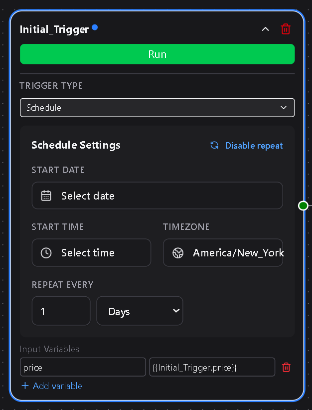

# Trigger Nodes

A **Trigger Node** is always the starting point of a workflow in **DSentr**.  
It defines *when* and *how* a workflow begins and introduces the first set of variables available to every downstream node.

Triggers do not accept inputs from other nodes.  
They are responsible for creating or receiving the initial data context that drives the workflow.

---

## 1. Trigger types

DSentr supports three trigger types:

| Type | Description |
|------|--------------|
| **Manual** | Executes the workflow when you click **Run** in the editor or dashboard. Useful for quick tests and one-off executions. |
| **Webhook** | Starts automatically when a POST request is received at the workflow’s unique webhook URL. Ideal for app integrations or external API calls. |
| **Schedule** | Runs automatically on a time interval or cron expression. Available only on **Workspace** plans. |

---

## 2. Manual trigger

The **Manual Trigger** is the simplest option.  
It doesn’t listen for events or external input — you run it manually inside the editor or dashboard.

Use cases:
- Testing new workflows before activation  
- Re-running workflows after debugging  
- Manually processing data without automation enabled

When executed, the manual trigger doesn’t introduce any default variables.  
However, you can define custom *input variables* that later nodes can reference — for example, `{{trigger.userId}}` or `{{trigger.email}}` if you specify them before running the test.

---

## 3. Webhook trigger

The **Webhook Trigger** starts a workflow when an HTTP POST request is sent to its unique webhook URL.

You can find the URL under:
**Settings → Webhook**

A webhook trigger URL follows this structure:

`https://api.DSentr.com/api/workflows/<workflow-id>/trigger/<token>`


### How it works
1. DSentr listens for incoming POST requests at that URL.  
2. The JSON body of the request becomes available as variables within the workflow.  
3. Each key in the request body is accessible using the syntax `{{webhooktrigger.key}}`.  

For example, given this request:

```bash
curl -X POST -H "Content-Type: application/json" \
-d '{"price": 29.99, "email": "test@example.com"}' \
https://api.DSentr.com/api/workflows/<workflow-id>/trigger/<token>
```
The trigger will expose two variables in scope:
```js
price = 29.99
email = test@example.com
```

Each key from the JSON payload becomes a variable that can be used by downstream nodes.  
To make these values accessible beyond the trigger, the webhook must reference itself in the **Input Variables** field using the exact casing of the node name:
```javascript
{{WebhookTrigger.price}}
{{WebhookTrigger.email}}
```

This step tells DSentr to pass those payload fields forward as output variables from the trigger.  
Subsequent nodes then reference them using the lowercase node name:
```js
{{webhooktrigger.price}}
{{webhooktrigger.email}}
```

This self-reference is required only for **Webhook Triggers**.  
Manual and Schedule triggers automatically make their variables available to all following nodes without additional configuration.

## 4. Schedule trigger

The **Schedule Trigger** runs a workflow automatically at a specific time or on a recurring interval.  
It is available **only on Workspace plans**.

Schedule triggers are useful for time-based automations like generating reports, syncing data, or running periodic maintenance without manual action.

---



### Configuration

When adding a schedule trigger, you’ll configure:

| Field | Description |
|--------|--------------|
| **Start Date** | The first date and time the workflow should run. |
| **Hour** | The hour of the day when the workflow should execute. |
| **Minute** | The exact minute within that hour when it should start. |
| **Time Zone** | Determines which time zone the trigger uses. Defaults to your workspace’s configured time zone. |
| **Enable Repeat** | When enabled, repeats the workflow at a defined interval. |
| **Repeat Every** | Sets how often to rerun the workflow (for example, every *X* minutes, hours, days, or weeks). |

Once configured and saved, DSentr automatically executes the workflow at the specified start time.  
If **Enable Repeat** is active, the workflow will continue to execute based on your selected interval.

---

### Recurring behavior

Each scheduled execution runs independently.  
If a workflow is still running when the next scheduled time arrives, DSentr automatically skips that run to prevent overlapping executions.  
You can view upcoming and completed runs from the **Run History** tab.

---

### Example use cases

- Send a **daily summary** email every morning at 8:00 AM.  
- Run a **weekly cleanup** every Friday afternoon.  
- Sync data with an external API every hour.  

---

### Best practices

- Keep scheduled workflows short and predictable; avoid long-running or overlapping jobs.  
- Use clear workflow names so you can identify recurring runs easily.  
- Only enable **Repeat** when continuous scheduling is required.  
- Avoid short repeat intervals (like every minute) unless absolutely necessary.  
- Remember: Schedule triggers are a **Workspace-only** feature.
- **If you want to stop a recurring scheduled workflow, click ***Disable Repeat*** and save the workflow. In order to start the recurring schedule again, you will need to reset the starting time on the node and ***Enable Repeat*** for the workflow to function as recurring again.**

---

The Schedule Trigger gives your workflows reliable, automated timing — ideal for recurring or time-sensitive operations that should happen without human intervention.

