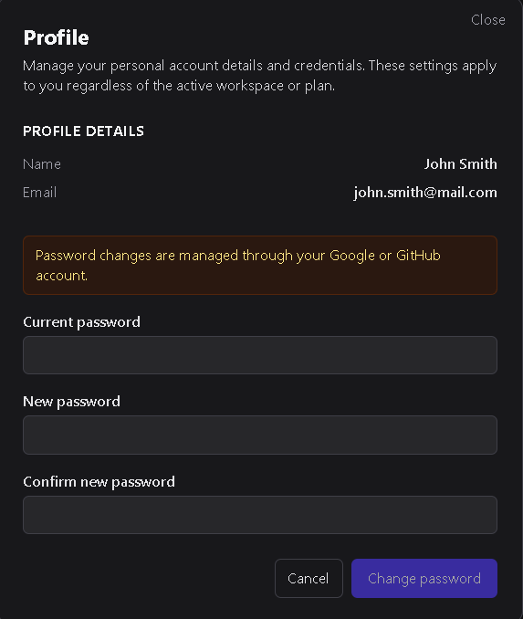

# User Profile

The **User Profile** screen allows you to manage your personal account credentials.  
These settings apply to your user account regardless of which workspace or plan you’re currently using.

---

## 1. Profile details

The profile screen displays your basic account information:

- **Name** — Your display name as it appears across DSentr.  
- **Email** — The address associated with your account.  

If your account was created using an OAuth provider (such as Google or GitHub), your password cannot be changed from within DSentr.

---

## 2. Changing your password

For accounts created directly with an email and password:

1. Enter your **current password**.  
2. Enter your **new password** and confirm it.  
3. Click **Change Password** to apply the update.  
4. Use **Cancel** to discard any changes.

Passwords changes take effect immediately after saving.

---

The **Profile** screen provides a simple way to update your personal credentials or review account details.  
OAuth users manage password changes through their identity provider, while standard users can securely update them within DSentr.
