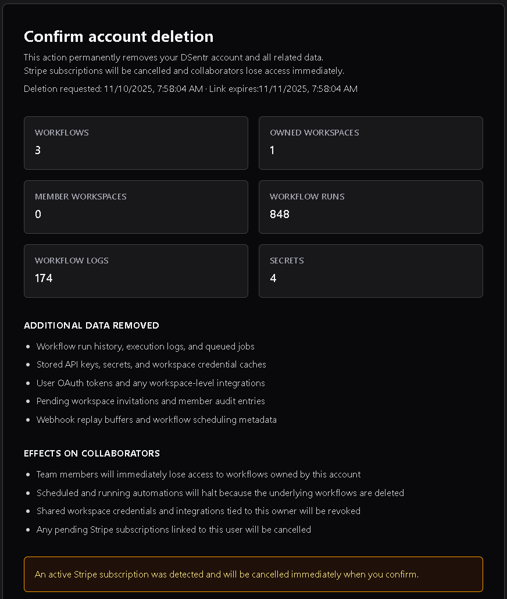

# Danger Zone

The **Danger Zone** allows you to permanently close your DSentr account and delete all associated data.  
This action is **irreversible** and immediately removes all workflows, data, and workspace memberships you own.  
Any active subscriptions are cancelled at once.

---

## 1. Overview

Deleting your DSentr account is permanent.  
All operational data is deleted immediately, though DSentr retains a minimal, non-public audit record to meet regulatory and legal requirements.

---

## 2. What will be deleted

When you delete your account, DSentr removes:

- Workflow run history, execution logs, and queued jobs.  
- Stored API keys, personal secrets, and workspace credential caches.  
- User OAuth tokens and workspace-level integrations tied to your account.  
- Pending workspace invitations and member audit entries.  
- Webhook replay buffers and workflow scheduling metadata.  

All associated data is purged from active systems.

---

## 3. Effects on others

Account deletion also affects any collaborators linked to your workflows or workspaces:

- Collaborators immediately lose access to workflows you own.  
- Active and scheduled automations stop running because the workflows are deleted.  
- Shared workspace credentials and integrations connected through your account are revoked.  
- Any active subscriptions tied to your account are cancelled automatically.  

---

## 4. Confirmation process

Because account deletion is permanent, DSentr requires confirmation to verify account ownership before deletion.

### For OAuth sign-ins (Google or GitHub)

1. Enter your **email address** in the Danger Zone settings.  
2. Click **Send Deletion Email**.  
3. You’ll receive a confirmation email with a link to complete deletion. 
4. On the confirmation page, re-enter your email address to finalize the process.  

This ensures you still control the mailbox associated with your account.

---

### For email and password sign-ins

1. Enter your **email address** and **current password** in the Danger Zone settings.  
2. Click **Send Deletion Email**.  
3. Follow the link sent to your inbox.  
4. Re-enter your password on the confirmation page to permanently delete your account.  

Both methods ensure that only the verified account owner can authorize deletion.

---

## 5. Irreversibility

Once confirmed:
- Your account, workflows, and all associated data are permanently deleted.  
- This action **cannot** be undone or recovered under any circumstances.  

---
After sending an email to confirm account deletion, the deletion confirmation link remains valid for 24 hours. If the deletion link is not used within 24 hours, the deletion request becomes invalid and the user will need to request deletion in the **Danger Zone** again.

The **Danger Zone** exists to give you full control over your data and account lifecycle — but once confirmed, deletion is final. Proceed carefully.
