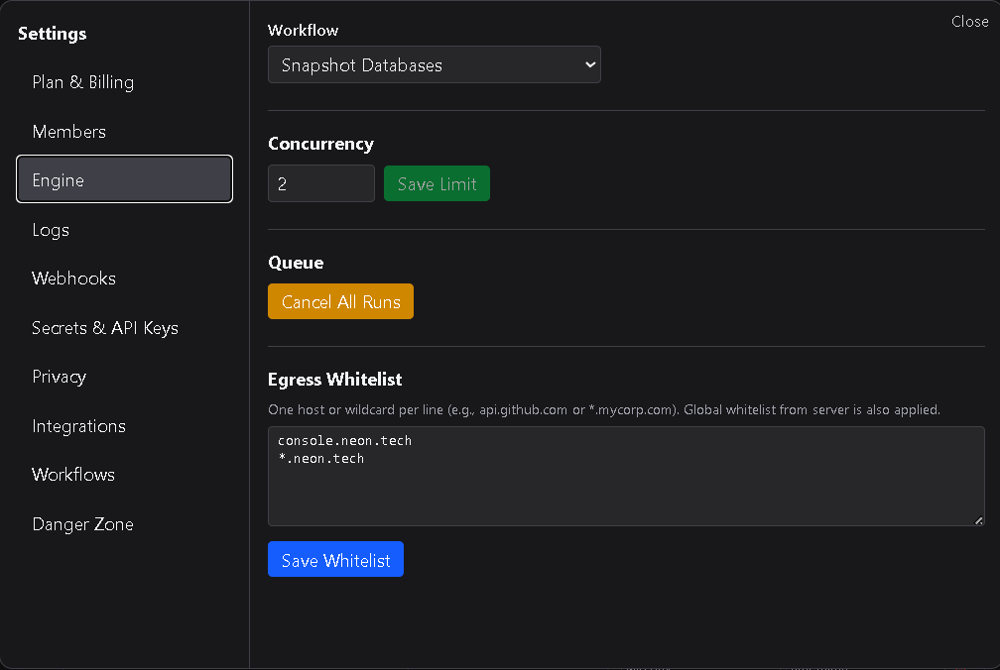

# Engine

The **Engine** tab controls how workflows execute inside your workspace.  
This section allows users to adjust concurrency, cancel running workflows, and configure egress rules for outbound HTTP requests.

---

## 1. Workflow concurrency

**Concurrency** defines how many workflows can run simultaneously within your workspace.  
Each active workflow execution counts toward this limit.

- **Solo Plans:** 1 concurrent workflow.  
- **Workspace Plans:** Configurable concurrency (higher limits).  

If the number of running workflows exceeds the concurrency limit, new runs are queued until a slot becomes available.  
Increasing concurrency can improve throughput but may use more system resources depending on your workflows’ complexity.

---

## 2. Cancel running workflows

You can immediately stop all currently running workflows from this section by selecting **Cancel All Running Workflows**.  
This command halts all active executions and clears pending runs from the queue.  
It’s primarily used for maintenance, debugging, or resetting stuck workflows during testing.

---

## 3. Egress Whitelist

The **Egress Whitelist** controls which external domains HTTP Request nodes are allowed to connect to.  
An egress whitelist entry must be configured **before** any HTTP Request node can make an outbound call.

Without a whitelist, all external requests from HTTP Request nodes are blocked by default.

### How it works
You explicitly define which domains your workspace can send requests to.  
Each entry can represent:
- A **top-level domain** (e.g., `dsentr.com`)  
- A **specific subdomain** (e.g., `api.dsentr.com`)  
- A **wildcard domain** (e.g., `*.dsentr.com`)  

Entries are evaluated exactly as written.  
Whitelisting `dsentr.com` permits requests to `https://dsentr.com`, but **not** to `https://api.dsentr.com`.  
To include subdomains, use a wildcard entry such as `*.dsentr.com`.

All requests from HTTP Request nodes are validated against your whitelist before execution.

---

### Security enforcement

DSentr enforces an **internal blacklist** of restricted domains.  
Connections to these domains are blocked at the platform level, **regardless** of your workspace’s whitelist configuration.  
This safeguard prevents misuse of HTTP Request nodes for unsafe, malicious, or otherwise **unscrupulous** external activity — protecting both users and the platform infrastructure.

---

## 4. Best practices

- Add only trusted domains to your whitelist.  
- Use wildcard entries sparingly; prefer explicit subdomains when possible.  
- Review your egress list regularly and remove unused entries.  
- Use **Cancel All Running Workflows** when testing new configurations to prevent unwanted network calls.  
- Keep concurrency at a reasonable level for your workspace size and expected workflow volume.

---

The **Engine** tab provides control over workflow execution performance and outbound connectivity — ensuring reliable automation while maintaining strict security boundaries.
