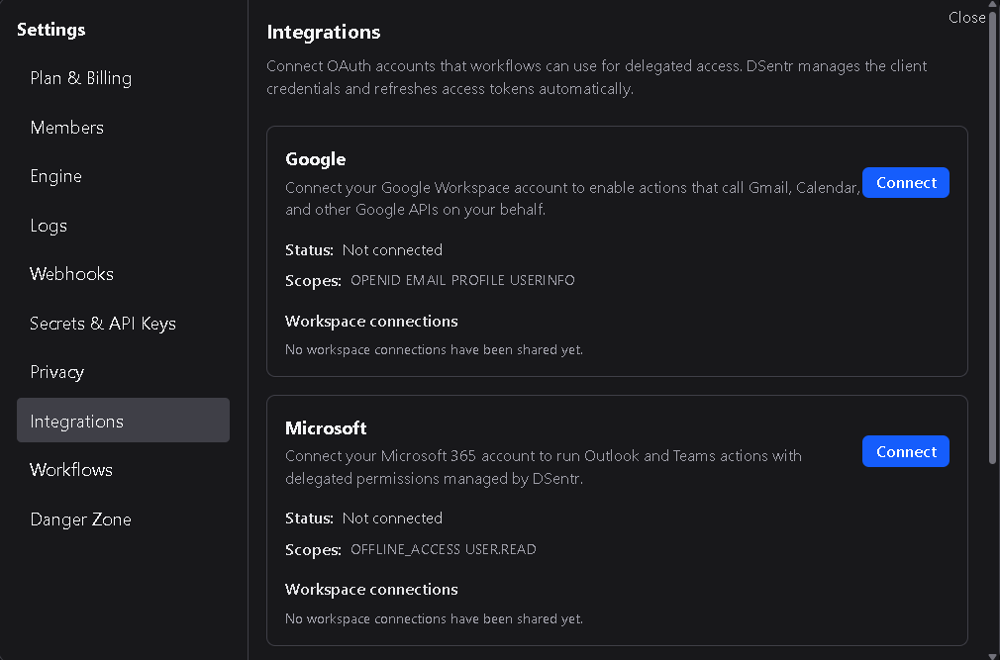
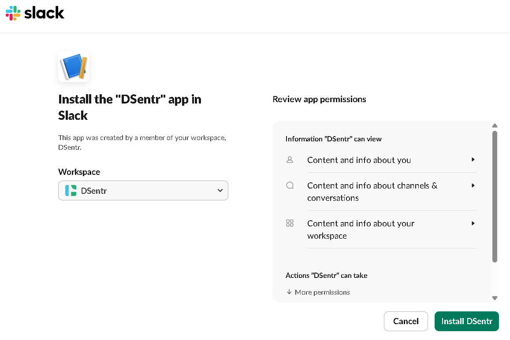
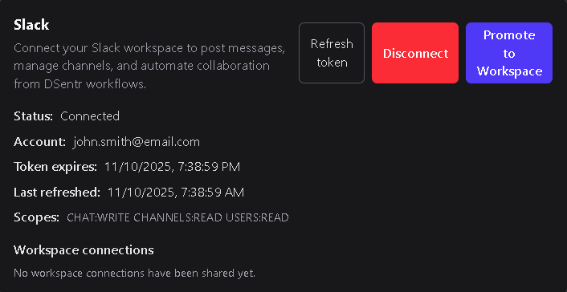
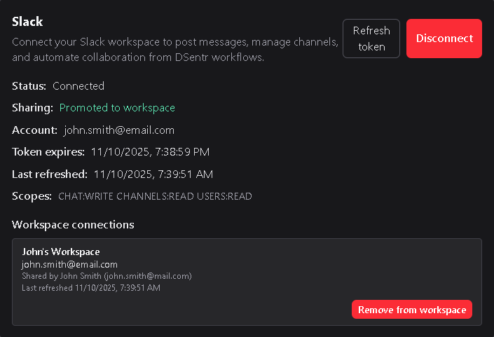

# Integrations

The **Integrations** page is available on **Workspace Plans** and manages OAuth connections to third-party services.  
These connections allow action nodes in your workflows to use authorized accounts from supported providers.

---

## 1. Supported providers

DSentr currently supports OAuth integrations for:

- **Google**  
- **Microsoft**  
- **Slack**

Each integration enables its corresponding action nodes to use authenticated access tokens for API calls.

---

## 2. Connecting an account

Each provider starts with a **Connect** button.  
When clicked, DSentr guides you through that provider’s OAuth flow.  
After authentication, you are returned to the **Integrations** page, where your new connection appears with details including:

- **Status** — Connected or not connected  
- **Account ID** — The identifier for the connected account (e.g., email address for Google)  
- **Token Expiration** — When the current token will expire  
- **Last Refreshed** — When DSentr last successfully renewed the token  
- **Scopes** — Permissions granted for this integration  
- **Shared to Workspace** — Indicates whether the connection is private or shared with your workspace  

---

## 3. Managing a connection

Each connection includes three management buttons:

- **Refresh Token** — Manually requests a new token if automatic renewal fails.  
- **Disconnect** — Revokes the OAuth connection. Any workflows using it will need to reconnect.  
- **Promote to Workspace** — Shares this connection with all members of the workspace.

When you promote a connection, other workspace members can select it in their workflows without authenticating separately.

---

## 4. Shared workspace connections

When a connection has been promoted to a workspace-level integration, additional details appear:

- **Workspace Name** — The name of the workspace using the connection  
- **Connection ID** — Account identifier (e.g., Google email)  
- **Shared By** — The user who originally connected and shared the account  
- **Last Token Refresh** — When the token was most recently renewed  

The OAuth account owner can also **Remove from Workspace**.  
This revokes access for other workspace members but keeps the integration active for the original owner.

---

## 5. Effects of removal

If a shared OAuth connection is disconnected or removed:
- Any workflows belonging to other users that relied on this connection will stop functioning.  
- If the user removing this connection has workflows that relied on this as a workspace connection, they will need to update their workflow to change this to use the personal connection in order for the workflow to continue to operate.
- Those workflows must be updated with a new or different connection to continue running.  
- Removing a connection does not delete workflows, only invalidates credentials of any nodes that used them.  

If the personal OAuth connection is disconnected or removed
- Any workflows belonging to *All* users that relied on this connection will stop functioning.  

---

## 6. Best practices

- Promote only accounts intended for shared automation.  
- Avoid sharing personal credentials unless necessary.  
- Periodically verify token status and expiration dates.  
- Reconnect integrations promptly if access tokens expire or are revoked.  

---

The **Integrations** page centralizes all connected services for your workspace — allowing you to authenticate once, share securely, and manage access across your entire team.
