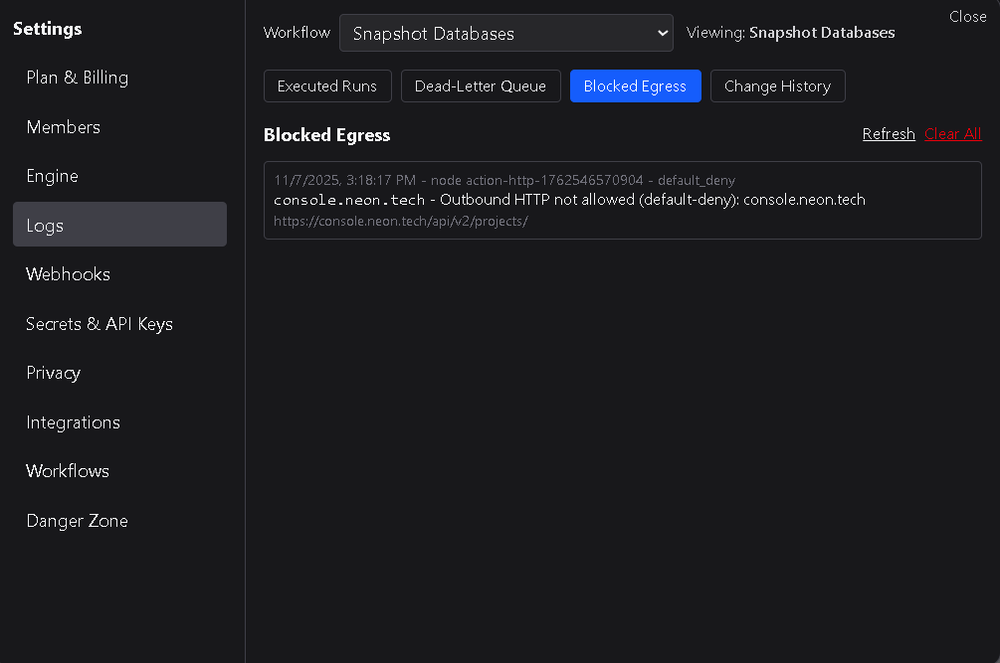

# Blocked Egress

The **Blocked Egress** view lists all workflow runs that failed because an HTTP Request node attempted to connect to a domain that was not allowed.  
Requests can be blocked when the destination is not listed in the workspace’s **Egress Whitelist** (under **Engine**) or when the target domain is restricted at the platform level.

---

## 1. Overview

Each entry in the Blocked Egress list includes:

| Field | Description |
|--------|--------------|
| **Date / Time** | When the blocked request occurred. |
| **Workflow Name** | The workflow in which the request was attempted. |
| **Node Name** | The specific node that attempted the connection. |
| **Reason** | The general reason the connection was denied. |
| **Origin** | The domain and subdomain of the attempted request. |
| **Full URL** | The complete URL that the node attempted to reach. |

This view helps identify workflows that are trying to reach destinations outside your approved network boundaries.

---

## 2. Causes of blocked egress

A workflow’s egress may be blocked when:
- The target domain is **not present** in your workspace’s Egress Whitelist.  
- The target domain or service is restricted by DSentr’s internal security policies.  

All HTTP Request nodes are validated against both the workspace whitelist and the platform’s global restrictions before execution.

---

## 3. Managing blocked entries

Blocked Egress entries are informational logs and do not affect other workflow runs.  
However, they can be reviewed to update whitelist entries or correct misconfigured nodes.

Only **workspace owners** and **admins** can clear this list.  
Clearing removes all blocked egress records but does **not** change any whitelist or workflow configurations.

---

## 4. Best practices

- Review this list regularly when adding or testing HTTP Request nodes.  
- Ensure required domains are explicitly listed in the **Egress Whitelist**.  
- Avoid broad wildcard whitelists unless absolutely necessary.  
- Use these logs to confirm that network restrictions are functioning as intended.  

---

The **Blocked Egress** view helps maintain network security by surfacing outbound requests that were denied — ensuring all HTTP Request nodes operate only within explicitly approved destinations.
