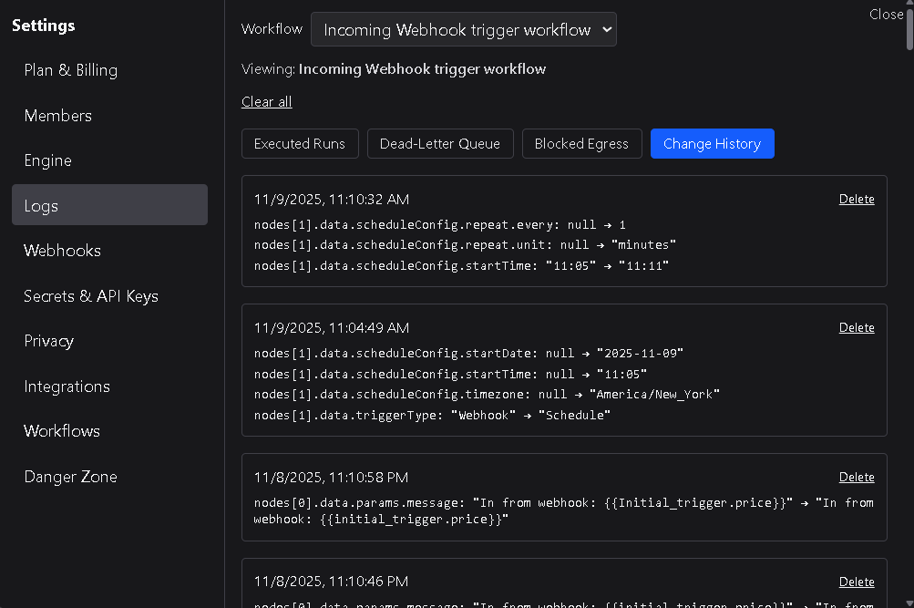

# Change History

The **Change History** log records every saved modification made to workflows within your workspace.  
Each time a workflow is saved on the canvas, DSentr creates a before-and-after snapshot that captures what was changed.  
This makes it possible to trace when a workflow started behaving differently or to recover previous values when troubleshooting errors.

---

## 1. Overview

Each entry in the Change History represents a single **workflow save**.  
Entries are grouped chronologically and display a header containing the **date and time** of the change.

Below each header, changes are listed by node and field, with a clear record of the value before and after the modification:

This format allows you to quickly identify which parts of a workflow were altered, even across multiple saves.

---

## 2. Purpose

Change History helps with:
- Investigating new errors that appear after recent edits.  
- Reviewing configuration updates made by different team members.  
- Comparing previous field values to restore a workflow to a known working state.  

By keeping a full audit of workflow saves, you can trace the evolution of a workflow and isolate the exact change that caused a behavior shift.

---

## 3. Data retention and clearing

The Change History grows as workflows evolve.  
To keep logs manageable, **workspace owners** and **admins** can clear this list at any time.

Clearing the Change History permanently removes all recorded snapshots.  
This action does **not** affect the workflows themselves — only the historical log of changes.

---

## 4. Best practices

- Use Change History as part of your troubleshooting process when workflows suddenly fail.  
- Review recent saves before reverting any logic or data mapping.  
- Limit clearing privileges to admins and owners to maintain accountability.  
- Keep a copy of critical snapshots externally if your workspace depends on precise historical configuration data.  

---

The **Change History** log provides transparency into every workflow modification — helping you track, review, and restore configurations with confidence.
