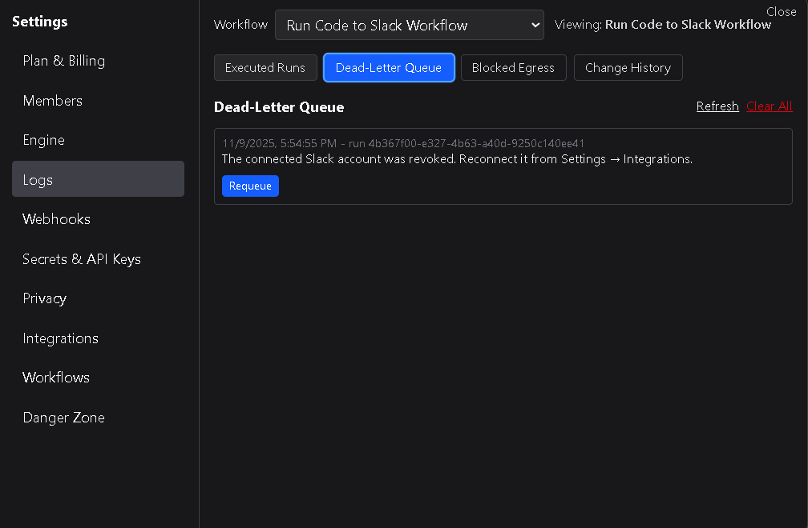

# Dead-Letter Queue

The **Dead-Letter Queue** lists all workflow runs that failed to complete successfully.  
It provides a quick way to review failed executions, understand what went wrong, and requeue eligible runs for another attempt.

---

## 1. Overview

Each entry in the Dead-Letter Queue includes:

| Column | Description |
|---------|--------------|
| **Workflow Name** | The name of the workflow that failed. |
| **Run ID** | The unique identifier for that failed run. |
| **Date / Time** | When the workflow execution began. |
| **Error Message** | A short summary of why the run failed (for example, timeout, invalid credentials, or missing data). |
| **Requeue** | A button to attempt re-running the workflow if it can be retried. |

This view helps identify which workflows are failing most often and whether the issue is transient or configuration-related.

---

## 2. Requeuing failed runs

If a failed run can safely be retried, a **Requeue** button appears beside it.  
Selecting **Requeue** places that run back into the workflow execution queue with the same input data and configuration as the original attempt.

Requeued runs behave exactly like new executions and appear in the **Executed Runs** list once completed.  
Not all failures can be retried; for example, malformed payloads or deleted nodes will prevent requeueing.

---

## 3. Clearing the queue

The Dead-Letter Queue can accumulate over time.  
To maintain a clean workspace, you can clear all entries.  
Only **workspace owners** and **admins** have permission to perform this action.

Clearing the queue permanently removes the failure records.  
This does **not** affect successful run logs or workflow configurations — only failed run records are deleted.

---

## 4. Common failure reasons

Typical causes of runs appearing in the Dead-Letter Queue include:
- Missing or expired API credentials.  
- Invalid input data or mapping errors.  
- HTTP Request node blocked by the Egress Whitelist.  
- Network timeouts or unreachable external services.  
- Logic or condition evaluation errors.  

Reviewing these errors helps you refine node configurations and prevent future failures.

---

## 5. Best practices

- Check the queue regularly for recurring failures.  
- Requeue only runs that failed for transient reasons (e.g., network issues).  
- Investigate repeated configuration or credential errors before retrying.  
- Clear the queue periodically to maintain workspace performance.  
- Restrict clearing permissions to owners and admins to preserve audit integrity.

---

The **Dead-Letter Queue** is your first stop for diagnosing failed workflow executions — providing context, quick retries, and a clean audit trail of what went wrong.
