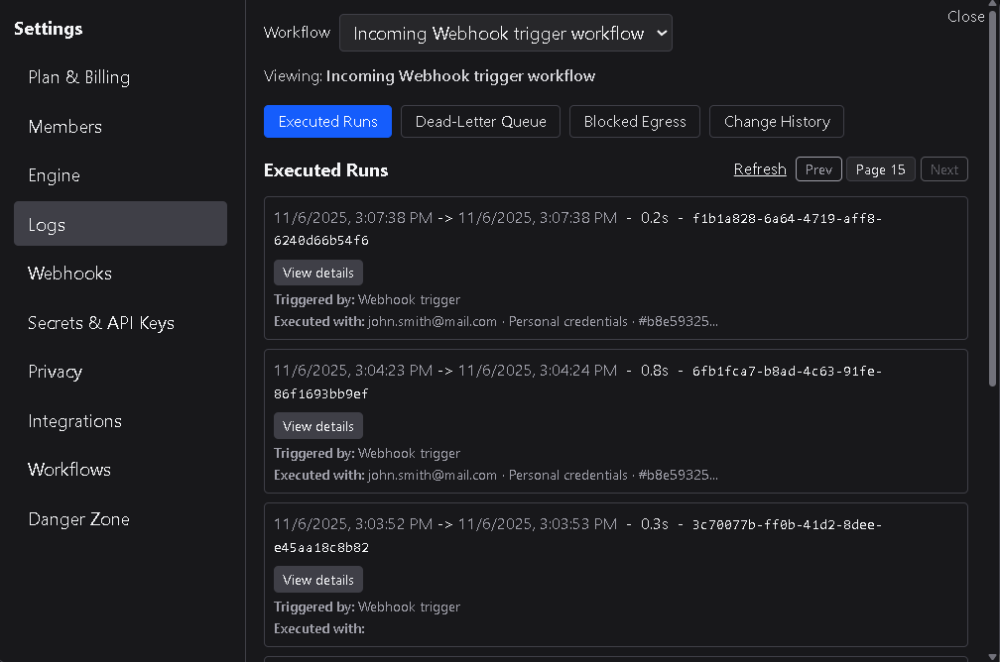
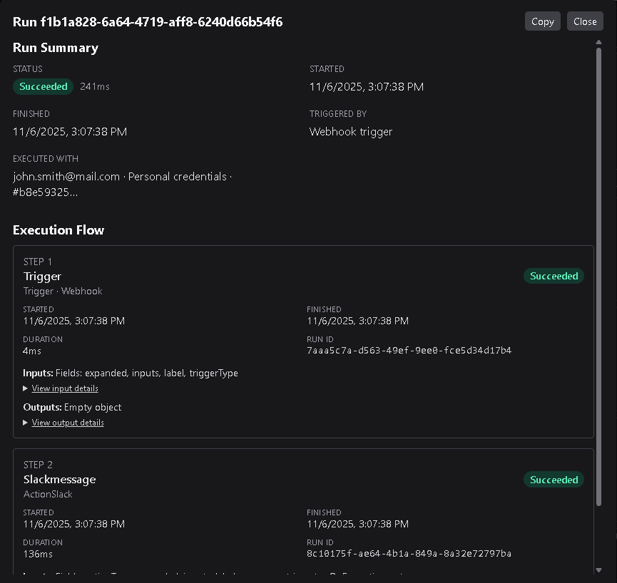
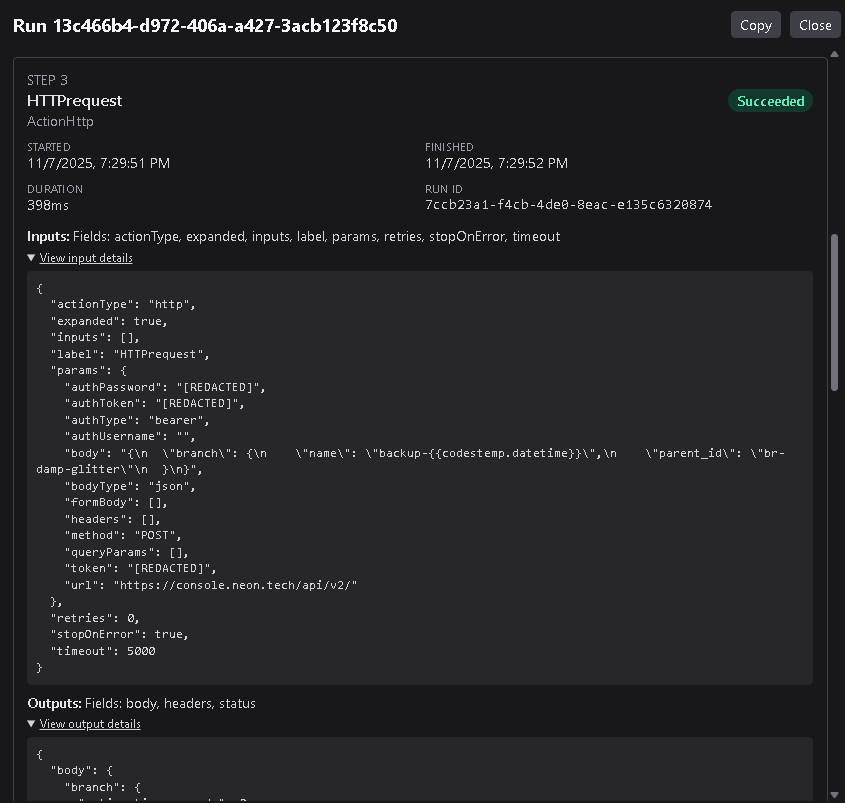

# Executed Runs

The **Executed Runs** view displays a record of every workflow run that has executed in your workspace.  
It provides detailed visibility into when workflows ran, how long they took, which triggers started them, and how each node within the workflow performed.

---

## 1. Overview

The Executed Runs page presents a grid of all recorded workflow executions.  
Each entry in the grid includes:

| Column | Description |
|---------|--------------|
| **Workflow Name** | The name of the workflow that was executed. |
| **Run ID** | The unique identifier assigned to that run. |
| **Start Time** | The date and time when execution began. |
| **End Time** | The date and time when execution completed. |
| **Duration** | Total runtime from start to finish. |
| **Trigger Type** | Indicates what started the workflow (Manual, Webhook, or Schedule). |
| **Credentials Used** | Shows any workspace-level credentials used during execution. |
| **View Details** | Opens a full run report overlay. |

The grid allows you to quickly confirm when workflows ran, how long they took, and what caused them to start.

---

## 2. Viewing run details

Click **View Details** beside any run to open an overlay showing the complete execution report.  
This detailed view contains two major sections: the **Run Summary** and the **Execution Flow**.

---

### Run Summary

The **Run Summary** appears at the top of the overlay and provides a concise overview of the workflow’s execution context.

It includes:
- **Status** — Displays whether the workflow succeeded or failed.  
- **Runtime** — Shows the total duration of the run.  
- **Started** — The timestamp when the run began.  
- **Finished** — The timestamp when the run ended.  
- **Trigger Type** — Identifies what initiated the run (Manual, Webhook, or Schedule).  
- **Workspace Credentials** — Lists any credentials used to authorize API calls or external services.  

At the top-right corner of the summary is a **Copy** button.  
Clicking it copies a full JSON-formatted report of the entire workflow run — including the run summary, node data, and results — to your clipboard.

---

### Execution Flow

The **Execution Flow** section visualizes how the workflow ran node by node.

Each node entry includes:
- **Node Name** — The name assigned to the node in the workflow.  
- **Node Type** — Indicates whether the node was a Trigger, Action, or Condition.  
- **Start Time / End Time** — The timestamps when this node’s execution began and completed.  
- **Duration** — How long the node took to execute.  
- **Node Run ID** — The unique identifier for that node’s execution, nested under the overall run ID.  
- **Status** — Shows **Succeeded** or **Failed** for that specific node (displayed in the node’s top-right corner).

Each node step also contains:
- **Inputs** — Expandable section displaying the input data passed into the node in JSON format.  
- **Outputs** — Expandable section showing the node’s resulting output in JSON format.

These details make it easy to trace exactly what data was processed, transformed, or sent at each step of the workflow.

Workflow logs automatically redact any API keys or secrets to ensure sensitive data is never exposed. This makes sharing logs with other users or support teams safer and more secure.

---

## 3. Using the run report

The JSON-formatted report available via the **Copy** button is a structured export of the entire run.  
It includes:
- Run metadata (ID, timestamps, trigger type).  
- Node-by-node input/output data.  
- Execution status for each node.  
- Any logged errors or warnings.

This report can be used for debugging, audit trails, or sharing run diagnostics with your team.

---

## 4. Best practices

- Use the **View Details** overlay to debug workflows step-by-step when results differ from expectations.  
- Copy and archive run reports for compliance or testing documentation.  
- Monitor long-duration runs to identify nodes that may need optimization.  
- Check failed nodes within successful runs to catch partial errors or external API timeouts.  

---

The **Executed Runs** view provides full visibility into workflow behavior — from trigger to completion — helping you validate results, track performance, and troubleshoot execution issues efficiently.
