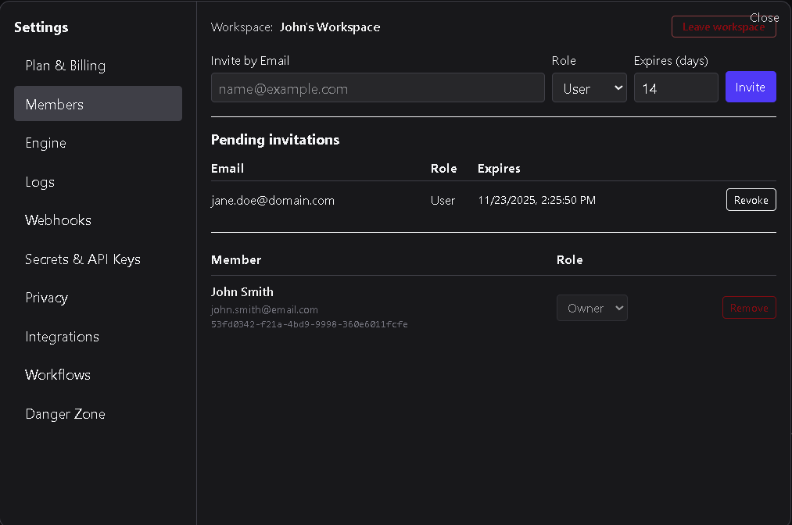
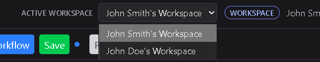

# Members

The **Members** tab is available only on **Workspace Plans**.  
It allows workspace owners and admins to invite, manage, and remove collaborators from a shared workspace.

---

## 1. Overview

Workspaces support multiple users who can collaborate on workflows, integrations, and settings.  
Each member is assigned a role that defines what they can view or modify within the workspace.

The workspace **Owner** is automatically listed as a member and cannot be removed.  
All other members are invited by email and appear in the members list once they accept their invitation.

---

## 2. Inviting members

Workspace owners and admins can invite others to join the workspace.

To invite a new member:
1. Enter the user’s **email address**.  
2. Select a **role**: *User*, *Viewer*, or *Admin*.  
3. Choose the number of **days until the invitation expires**.  
4. Click **Send Invite**.

### Invitation behavior
- **New users** (without a DSentr account) receive an email to create an account.  
  Once registered and logged in, they will be prompted to join the inviting workspace.  
- **Existing DSentr users** receive an in-app notification and can accept directly from their dashboard.  

Invitations remain valid until accepted, declined, revoked, or expired.

When a user is invited to a workspace, the next time they are logged into their account, they will receive the invitation followed by the confirmation of accepting or declining.

When a user accepts an invitation and joins another workspace, they will now be able to go back and forth between their own workspace and the joined workspace.

---

## 3. Member list

Below the invite form is a list of all current and pending workspace members.  
Each entry shows:
- The member’s **name and email**  
- Their assigned **role**  
- A **Remove** button (if permitted)  

Members appear in this list once they have accepted their invitation.  
Pending invites display their status until accepted or expired.

---

## 4. Roles and permissions

Each member’s role determines their level of access within the workspace.

| Role | Description |
|------|--------------|
| **Owner** | Full control over the workspace, billing, and members. This role is automatically assigned to the account holder and **cannot be transferred**. |
| **Admin** | Can manage workflows, invite or remove members, and adjust workspace settings. |
| **User** | Can create, edit, and run workflows, but cannot manage members or billing. |
| **Viewer** | Has read-only access to workflows and settings. |

Owners and Admins can change other members’ roles or remove members as needed.

---

### Locking a workflow

In a workspace plan, workflow creator's have the option to lock a workflow to prevent accidental changes to it. When a workflow is locked, other user's are prevented from saving changes to that workflow.

---

## 5. Removing or leaving a workspace

- **Owners and Admins** can remove other members directly from the member list.  
- **Members** (User or Viewer roles) can leave a workspace at any time by clicking **Leave Workspace** at the top of the page.  
- When a user leaves or is removed from a workspace, they immediately lose access to all workflows, secrets, and integrations. Any secrets, API keys, or OAuth credentials owned by that user are also revoked from the workspace. Workflows that relied on those credentials must be updated with new ones before they can run successfully again.

The **Owner** cannot be removed or leave the workspace while the Workspace Plan is active.

---

## 6. Best practices

- Invite only trusted collaborators; workspace data and secrets are shared among members.  
- Assign roles carefully to maintain appropriate access control.  
- Remove inactive members regularly to keep the member list up to date.  
- Remember that ownership is tied to the subscription holder and cannot be reassigned.  

---

The **Members** tab provides a centralized place for managing your workspace team — invite collaborators, control permissions, and maintain secure shared access across your automations.
