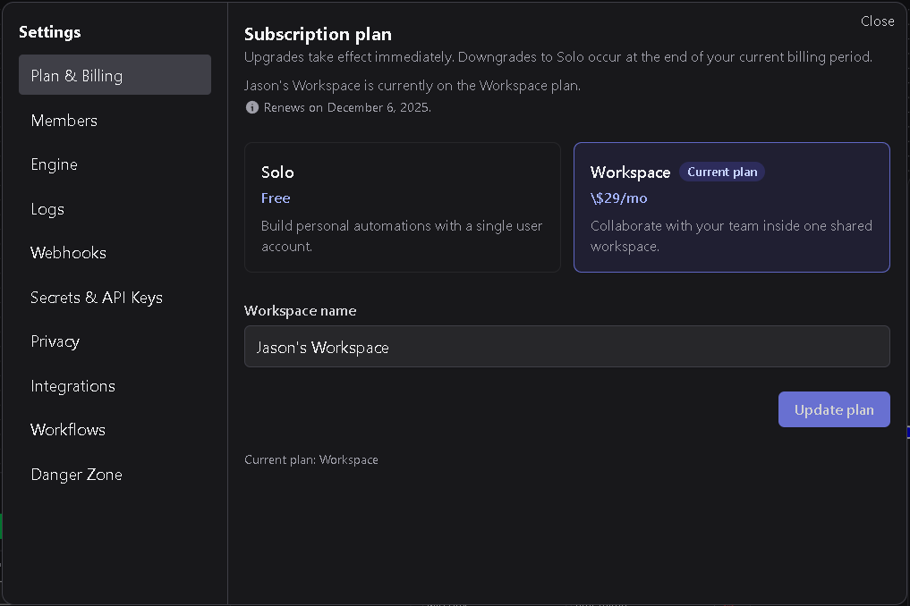

# Plan & Billing

The **Plan & Billing** section manages your DSentr subscription.  
From here, you can view your current plan, upgrade to a Workspace plan, downgrade to Solo, and see when your next billing or downgrade takes effect.

---

## 1. Plan options

DSentr offers two subscription tiers:

| Plan | Description |
|------|--------------|
| **Solo** | The default plan for individual use. Supports a single user with no shared workspace features. |
| **Workspace** | A paid plan that adds multi-user support, integrations, scheduling, and other advanced features. Renews automatically on a monthly basis. |

Your current plan is shown at the top of the screen, along with your next renewal date or downgrade date if you’ve scheduled a plan change.

---

## 2. Upgrading to Workspace

If you are currently on the **Solo Plan**, selecting **Workspace Plan** begins the upgrade process.

1. Enter a **workspace name**. This name uniquely identifies your workspace and **cannot be changed** once created.  
2. Proceed to the **payment screen** to complete your subscription.  
3. Once payment is confirmed, your environment is immediately upgraded to a **Workspace Plan**.  

The Workspace Plan renews automatically each month unless cancelled or downgraded.  
Your active features (multi-user access, integrations, scheduling, etc.) become available right after payment confirmation.

---

## 3. Downgrading to Solo

If you are currently on a **Workspace Plan**, you can return to a **Solo Plan** at any time by selecting **Solo Plan** and clicking **Update Plan**.

- The downgrade takes effect **after your current billing cycle ends**.  
- Until then, you retain full Workspace functionality.  
- Once the billing cycle completes, your subscription cancels automatically and your environment reverts to Solo.

If you change your mind before the cycle ends, you can resume your Workspace subscription.

---

## 4. Resuming a Workspace subscription

If you’ve downgraded but your Workspace plan is still active through the end of the billing cycle, a **Resume Subscription** button appears in the Workspace Plan section.  

Clicking **Resume Subscription** reactivates automatic renewal and keeps your environment on the Workspace Plan without interruption.  
You will continue to be billed monthly going forward.

---

## 5. Renewal and downgrade dates

Your billing section displays one of the following messages depending on your current status:

| Status | Message |
|---------|----------|
| **Active Workspace Plan** | Shows the **next renewal date**. |
| **Scheduled Downgrade** | Displays the **downgrade date** when your Workspace plan will revert to Solo. |
| **Active Solo Plan** | Indicates that no paid subscription is active. |

All billing actions are processed immediately and reflected in your plan status section.

---

## 6. Best practices

- Choose your **workspace name** carefully — it cannot be changed later.  
- Keep your payment method up to date to avoid service interruptions.  
- Use **Resume Subscription** before the downgrade date if you want to stay on the Workspace Plan.  
- Check your next renewal or downgrade date periodically to confirm billing status.  

---

The **Plan & Billing** page gives you full control over your subscription — upgrade, downgrade, or resume your plan at any time while keeping clear visibility into your renewal cycle.
