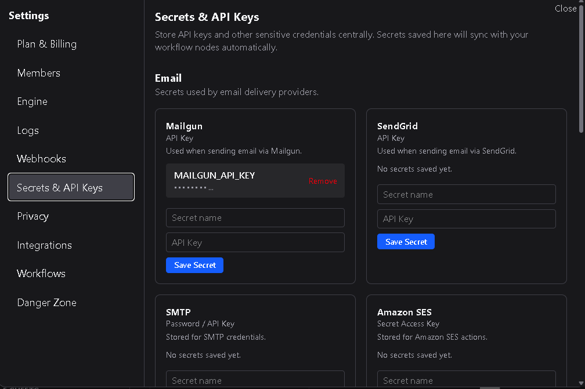

# Secrets & API Keys

The **Secrets & API Keys** section stores credentials used by action nodes during workflow execution.  
This includes passwords, API keys, bearer tokens, and other authentication values required to connect with external services.

---

## 1. Overview

Each secret you create is associated with a specific **action node type**.  
Secrets are only selectable by nodes of the same type.

For example:
- A **Bearer Token** created under the **HTTP Request** category will only be available to HTTP Request action nodes.  
- A **SendGrid API Key** created under the **SendGrid** category will only be selectable within SendGrid nodes.  
- Credentials defined for **Mailgun**, **Slack**, or other integrations follow the same rule.

This mapping ensures credentials are scoped correctly and cannot be accidentally reused across unrelated services.

---

## 2. Creating secrets

When adding a new secret or API key:
1. Select the **integration type** or node category (e.g., HTTP Request, SendGrid).  
2. Enter the required credential value, such as a password, bearer token, or API key.  
3. Save the entry.

Once saved, the secret is securely encrypted and stored.  
It will never be displayed again in plain text — only referenced by name or label when configuring nodes.

---

## 3. Workspace behavior

On **Workspace Plans**, secrets are shared among members of the workspace for collaborative workflow configuration.  
Access is still restricted to the appropriate node type.

If a member who created a secret or API key **leaves** or is **removed** from the workspace:
- All secrets and API keys created by that user are **automatically deleted**.  
- Any workflows that used those credentials will require reconfiguration before they can run successfully.  

This prevents orphaned or insecure credentials from remaining active in shared environments.

---

## 4. Managing secrets

Workspace **Owners** and **Admins** can:
- View a list of all existing secrets and their associated node types.  
- Remove secrets or API keys that are no longer needed.  
- Rotate credentials by deleting and recreating them with updated values.  

Deleted secrets immediately become invalid, and any workflows referencing them will fail until updated with a valid replacement.

---

## 5. Security and handling

- Secrets are encrypted at rest and never shown in plaintext after creation.  
- Each secret is only usable within its defined integration type.
- Use descriptive names for credentials to avoid confusion across workflows.  

---

The **Secrets & API Keys** page centralizes credential management for your workspace — keeping integrations secure, scoped correctly, and easily maintainable as your workflows evolve. Workflow nodes that use OAuth connections are managed under the *Integrations* setting.
