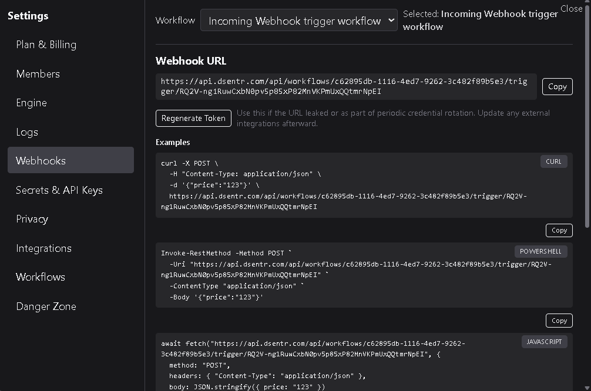
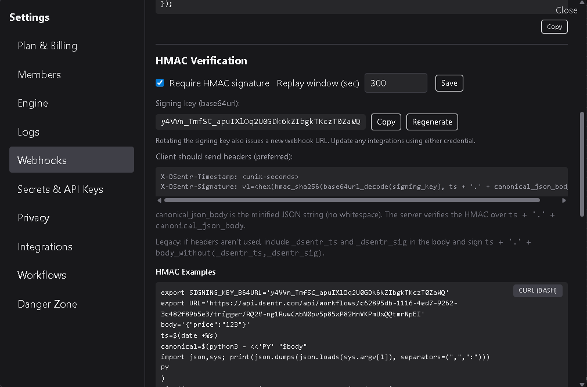

# Webhooks

The **Webhooks** page displays your workflow’s unique webhook URL and provides tools for managing, securing, and testing it.  
Webhooks allow external systems to trigger workflows by sending HTTP requests directly to Dsentr.

---

## 1. Webhook URL

Every workflow that begins with a **Webhook Trigger** has its own URL endpoint.  
This URL includes both a **workflow ID** and a **workflow token** that uniquely identify the workflow.

Example:
`https://api.dsentr.com/api/workflows/<workflow-id>/trigger/<token>`


You can:
- **Copy** the webhook URL to your clipboard.  
- **Regenerate Token** to issue a new URL and invalidate the old one.  

Regenerating a token immediately disables the existing webhook URL.  
Any external integrations or scripts using the old URL must be updated with the new one.  
This is useful if a token was accidentally shared or you need to rotate credentials for security.



---

## 2. Calling the webhook

Once you have your webhook URL, you can send data to it using different tools.  
All examples below can be copied directly from the interface.

### cURL
```curl
curl -X POST -H "Content-Type: application/json"
-d '{"message":"Hello from Dsentr"}'
https://api.dsentr.com/api/workflows/<workflow-id>/trigger/<token>
```

### PowerShell
```powershell
Invoke-RestMethod -Uri "https://api.dsentr.com/api/workflows/<workflow-id>/trigger/<token>" -Method POST
-Headers @{"Content-Type"="application/json"} `
-Body '{"message":"Hello from Dsentr"}'
```

### Javascript
```js
await fetch("https://api.dsentr.com/api/workflows/<workflow-id>/trigger/<token>", {
  method: "POST",
  headers: { "Content-Type": "application/json" },
  body: JSON.stringify({ message: "Hello from Dsentr" })
});
```

All examples use a simple JSON body. You can send any valid JSON structure; each key becomes a variable available inside your workflow.

### Enabling HMAC signatures (Workspace Plan only)

For **Workspace Plans**, you can enable **HMAC verification** to ensure incoming webhook requests are genuine and haven’t been altered in transit.  
When enabled, Dsentr validates every request using your workspace’s secret signing key before the workflow is triggered.

This feature is strongly recommended if your webhooks are exposed to public or third-party systems.



---

### Replay window

The **Replay Window** defines how long a signed webhook request remains valid after its timestamp.  
It is measured in seconds.  

For example, if the replay window is set to **300**, Dsentr accepts requests that arrive within 5 minutes of their timestamp and rejects anything older.  
This prevents “replay attacks,” where someone captures and resends a previously valid request.

Choose a replay window large enough for normal network delay but short enough to keep your webhook endpoint secure.

---

### Signing key

When HMAC protection is enabled, Dsentr generates a **Base64URL-encoded signing key** for your workspace.  
This key is used to compute and verify message signatures.

You can:
- **Copy** the signing key for use in your client code.  
- **Regenerate** it at any time if you need to rotate credentials.

Rotating the signing key also issues a new webhook URL.  
Any clients or integrations using either credential must be updated immediately.

---

### HMAC signing specification

Clients must include two headers when sending a signed webhook request:
```json
X-DSentr-Timestamp: <unix-seconds>
X-DSentr-Signature: v1=<hex(hmac_sha256(base64url_decode(signing_key), ts + '.' + canonical_json_body))>
```


Where:
- `signing_key` is your current Base64URL-encoded signing key.  
- `ts` is the Unix timestamp sent in `X-DSentr-Timestamp`.  
- `canonical_json_body` is the **minified** JSON payload (no whitespace).  
- The server verifies the HMAC by recomputing the hash over `ts + '.' + canonical_json_body`.

#### Example process

1. Prepare the body:
  ```json
  {"message":"Hello from Dsentr"}
  ```
2. Generate a timestamp, for example 1731100000.

3. Compute:
  ```js
  message = ts + '.' + '{"message":"Hello from Dsentr"}'
  signature = HMAC_SHA256(signing_key, message)
  ```

4. Send:
  ```json
  X-DSentr-Timestamp: 1731100000
  X-DSentr-Signature: v1=<hex(signature)>
  ```
along with the JSON body.

DSentr verifies that:
* The timestamp is within your replay window.
* The computed HMAC matches the provided signature.

Only valid, untampered requests proceed to trigger the workflow.

### Legacy format

If your client cannot send custom headers, you can include the following fields in the JSON body:

```json
_dsentr_ts: <unix-seconds>
_dsentr_sig: <computed-signature>
```

In this case, the signature should be generated over the same string:  
`ts + '.' + body_without(_dsentr_ts,_dsentr_sig)`

This method provides backward compatibility with systems that cannot modify headers, though header-based signing is preferred for new integrations.

---

### HMAC examples

cURL:
```curl
  export SIGNING_KEY_B64URL='y4VVn_TmfSC_apuIXlOq2U0GDk6kZIbgkTKczT0ZaWQ'
  export URL='https://api.dsentr.com/api/workflows/c62895db-1116-4ed7-9262-3c482f89b5e3/trigger/RQ2V-ng1RuwCxbN0pv5p85xP82MnVKPmUxQQtmrNpEI'
  body='{"price":"123"}'
  ts=$(date +%s)
  canonical=$(python3 - <<'PY' "$body"
  import json,sys; print(json.dumps(json.loads(sys.argv[1]), separators=(",",":")))
  PY
  )
  sig=$(python3 - <<'PY' "$SIGNING_KEY_B64URL" "$ts.$canonical"
  import base64,hmac,hashlib,sys
  k=sys.argv[1]; k+= '='*((4-len(k)%4)%4)
  print(hmac.new(base64.urlsafe_b64decode(k), sys.argv[2].encode(), hashlib.sha256).hexdigest())
  PY
  )
  curl -X POST \
    -H "Content-Type: application/json" \
    -H "X-DSentr-Timestamp: $ts" \
    -H "X-DSentr-Signature: v1=$sig" \
    -d "$canonical" \
    "$URL"
```

PowerShell:
```powershell
  $SIGNING_KEY_B64URL = 'y4VVn_TmfSC_apuIXlOq2U0GDk6kZIbgkTKczT0ZaWQ'
  $URL = 'https://api.dsentr.com/api/workflows/c62895db-1116-4ed7-9262-3c482f89b5e3/trigger/RQ2V-ng1RuwCxbN0pv5p85xP82MnVKPmUxQQtmrNpEI'
  $body = '{"price":"123"}'
  $canonical = ($body | ConvertFrom-Json) | ConvertTo-Json -Compress
  $ts = [DateTimeOffset]::UtcNow.ToUnixTimeSeconds().ToString()
  function Decode-Base64Url([string]$s){ $pad=(4-($s.Length%4))%4; $s+=('='*$pad); $s=$s.Replace('-','+').Replace('_','/'); [Convert]::FromBase64String($s) }
  $keyBytes = Decode-Base64Url $SIGNING_KEY_B64URL
  $hmac = New-Object System.Security.Cryptography.HMACSHA256($keyBytes)
  $payload = [Text.Encoding]::UTF8.GetBytes($ts + '.' + $canonical)
  $sigHex = -join ($hmac.ComputeHash($payload) | ForEach-Object { $_.ToString('x2') })
  $headers = @{ 'Content-Type'='application/json'; 'X-DSentr-Timestamp'=$ts; 'X-DSentr-Signature'='v1=' + $sigHex }
  Invoke-RestMethod -Method POST -Uri $URL -Headers $headers -Body $canonical
```

Javascript:
```js
  // Node 18+ (global fetch). Replace signing key and URL.
  const keyB64Url = 'y4VVn_TmfSC_apuIXlOq2U0GDk6kZIbgkTKczT0ZaWQ';
  const url = 'https://api.dsentr.com/api/workflows/c62895db-1116-4ed7-9262-3c482f89b5e3/trigger/RQ2V-ng1RuwCxbN0pv5p85xP82MnVKPmUxQQtmrNpEI';
  const body = { price: '123' };
  const ts = Math.floor(Date.now()/1000).toString();
  const canonical = JSON.stringify(body);
  const pad = '='.repeat((4 - (keyB64Url.length % 4)) % 4);
  const key = Buffer.from(keyB64Url.replace(/-/g,'+').replace(/_/g,'/') + pad, 'base64');
  import crypto from 'node:crypto';
  const sigHex = crypto.createHmac('sha256', key).update(ts + '.' + canonical).digest('hex');
  await fetch(url, {
    method: 'POST',
    headers: {
      'Content-Type': 'application/json',
      'X-DSentr-Timestamp': ts,
      'X-DSentr-Signature': 'v1=' + sigHex
    },
    body: canonical
  });
```

---

Best practices
* Rotate tokens and signing keys immediately if they might be exposed.
* Keep your signing key private; never commit it to version control or share it publicly.
* Use a replay window of 60–300 seconds for balanced security and reliability.
* Prefer header-based signatures instead of including values in the body.
* Test webhook calls with the provided examples before connecting production integrations.

The Webhooks HMAC feature adds signature validation and replay protection, ensuring only trusted, verifiable requests can trigger your workflows.