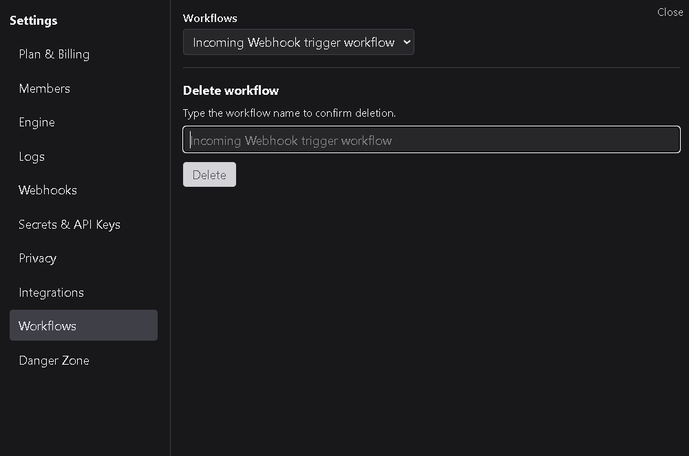

# Workflows

The **Workflows** tab lists all workflows currently part of the workspace.  
From here, you can permanently delete workflows that are no longer needed.

---

## 1. Deleting a workflow

To delete a workflow:

1. Select the workflow you want to remove.  
2. Type the **workspace name** exactly as shown to confirm deletion.  
3. Click **Delete Workflow**.

Deletion is immediate and cannot be undone.  
All run history, logs, and associated data for that workflow are removed from the workspace.

---

## 2. Notes

- Only workspace **Owners** and **Admins** can delete workflows.  
- Workflows deleted here are not recoverable.  
- If a deleted workflow was connected to external integrations or secrets, those connections remain intact for other workflows.

---

This page is currently focused on workflow removal.  
Future versions may expand to include additional management tools such as workflow archiving, renaming, or exporting.
