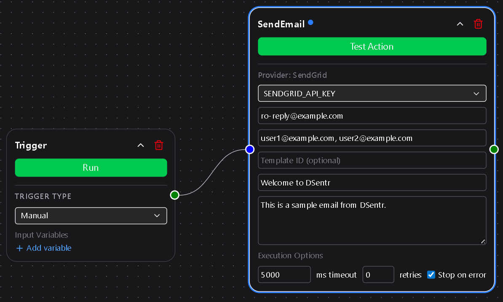
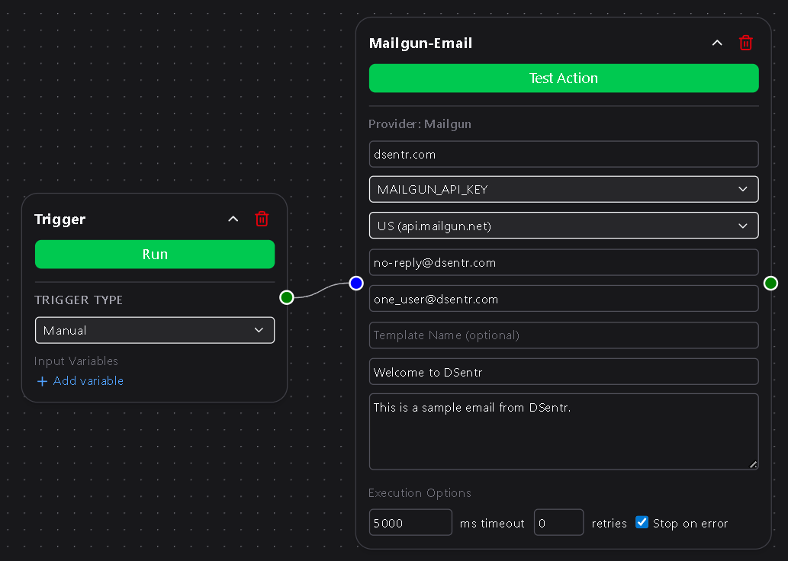
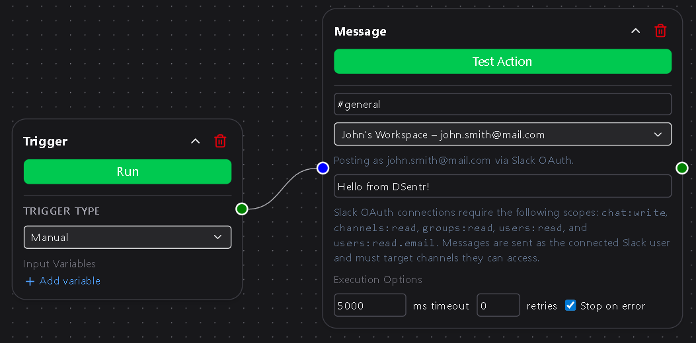
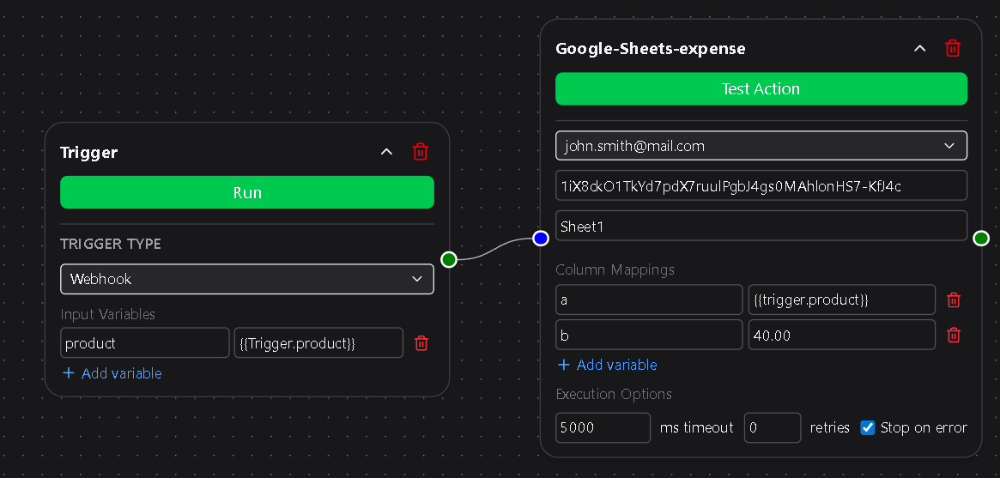
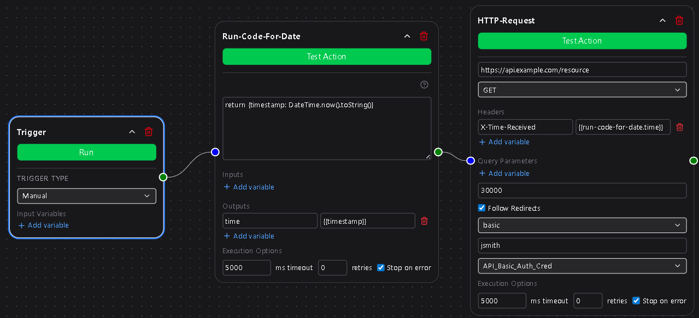
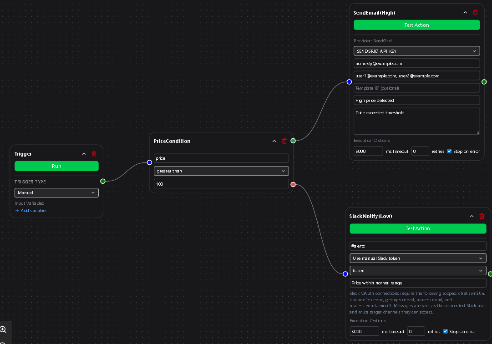

# Prebuilt Workflow Templates

When you open a blank workflow canvas, it can feel like a lot of empty space. Templates fix that. They’re ready-made workflow blueprints you can load into an empty grid to skip setup and start building right away.

To use one, scroll to the bottom of the **Nodes** sidebar, find the **Templates** section, and click **Show**. Pick a template to automatically place its nodes onto the canvas, then adjust the details as needed.

---

## Available Templates

### SendGrid Email
Adds a **Manual Trigger** and a **SendGrid** action node.  
Enter your API key, subject, and message body, then run the workflow to start sending emails from your SendGrid account.

---

### Amazon SES Email
Adds a **Manual Trigger** and an **Amazon SES** action node.  
Connect your AWS credentials, configure message details, and you’re ready to send directly from your AWS account.

---

### Mailgun Email
Adds a **Manual Trigger** and a **Mailgun** action node.  
Link your Mailgun domain and API key, fill in your message, and send test emails in seconds.

---

### Slack Message
Adds a **Manual Trigger** and a **Slack** action node.  
Connect your Slack account via webhook or OAuth, set a message, and send it straight to a chosen channel.

---

### Google Sheets
Adds a **Manual Trigger** and a **Google Sheets** action node.  
Connect your Google account, map your sheet and columns, then insert or update data with one click.

---

### Run Code and Send HTTP Request
Adds a **Manual Trigger**, a **Run Code** node, and an **HTTP Request** node.  
Write JavaScript logic, define your HTTP request, and instantly test the pipeline from code to external API.

---

### Branch by Condition
Adds a **Manual Trigger** and a **Condition** node.  
The **true** path connects to a **SendGrid** node; the **false** path connects to **Slack**.  
Define a comparison, fill in the message details, and test conditional execution in real time.

---

Templates are practical starting points that help you understand how triggers and actions interact, how data flows, and how logic branches in a workflow.  
Each one can be customized, extended, or replaced to fit your project.  

More templates will be added over time.  
Illustrations in this section show how each template appears when added to the canvas.
